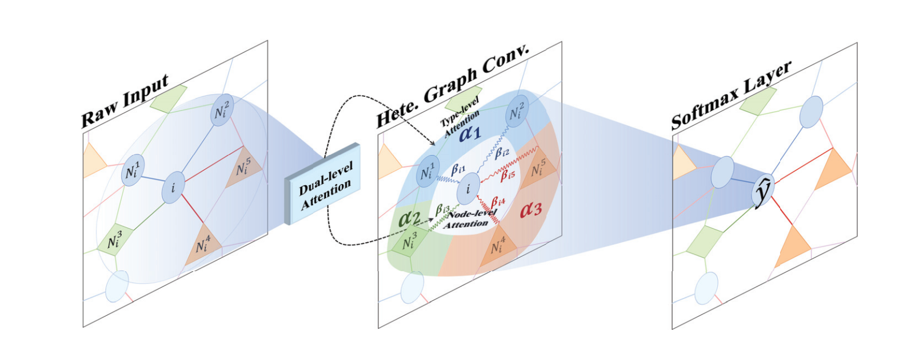
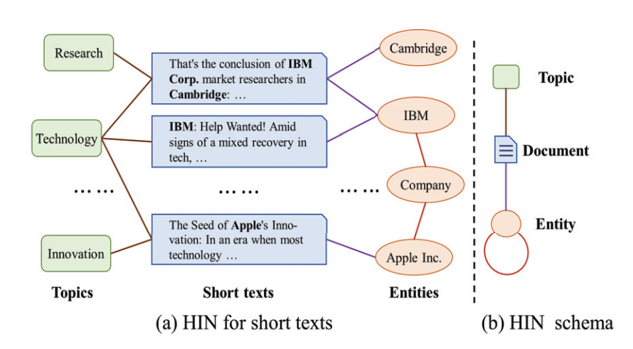

# HGAT

Tên đầy đủ: Heterogeneous Graph Attention Network
Lĩnh vực: Graph Neural Networks / Deep Learning
Link paper tham khảo: <https://aclanthology.org/D19-1488/>
---

## Bài toán và thách thức

---

## Vấn đề HGAT giải quyết

- Ở lĩnh vực phân loại văn bản ngắn (như tiêu đề tin tức, tweet, câu tìm kiếm, đánh giá sản phẩm) đang gặp phải 3 thách thức khi sử dụng các mô hình ML/DL truyền thống:
  - **Độ thưa thớt ngữ nghĩa**: Văn bản ngắn chứa quá ít từ, thiếu ngữ cảnh, dẫn đến việc các mô hình học máy truyền thống không có đủ đặc trưng (features) để phân tích.
  - **Thiếu dữ liệu có gắn nhãn**: Gắn nhãn thủ công cho khối lượng dataset đủ để một mô hình ML/DL học rất tốn công. Các mô hình học sâu (CNN, RNN) thường hoạt động rất tệ nếu thiếu dữ liệu huấn luyện.
  - **Nhiễu thông tin:** Khi cố gắng bổ sung thông tin từ bên ngoài để làm giàu ngữ cảnh (như thêm thực thể hoặc chủ đề), chúng ta dễ kéo theo các thông tin gây nhiễu (noise), làm giảm độ chính xác.

---

## Giải pháp: HGAT (Heterogeneous Graph ATtention networks)

### HGAT là gì?

- HGAT (Heterogeneous Graph ATtention networks) dùng để phân loại văn bản ngắn (short text classification) trong môi trường bán giám sát (semi-supervised - tức là chỉ có một ít dữ liệu đã gán nhãn và rất nhiều dữ liệu chưa gán nhãn).

#### Kiến trúc

- Kiến trúc tổng thể gồm 4 tầng:
  - Tầng Đầu vào: **Heterogeneous Information Network (HIN)**
  - Tầng Chiếu Không gian ẩn (Feature Projection)
  - Tầng Chú ý hai cấp độ (Dual-level Attention)
  - Tầng Đầu ra: Phân loại (Softmax Classifier)

#### Xây dựng mạng thông tin dị thể (HIN - Heterogeneous Information Network)

- Tác giả thay vì coi văn bản là 1 chuỗi từ thì họ xây một đồ thị chứa 3 loại node khác nhau:
  - **Nút Văn bản (Document - $D$)**: Chính là các đoạn văn bản ngắn cần phân loại.
  - **Nút Chủ đề (Topic - $T$)**: Trích xuất thông qua mô hình LDA. Một văn bản sẽ nối với các chủ đề mà nó có xác suất thuộc về cao nhất.
  - **Nút Thực thể (Entity - $E$)**: Trích xuất các thực thể xuất hiện trong văn bản (ví dụ: "Apple Inc.", "IBM") bằng công cụ TAGME và liên kết chúng với Wikipedia.
- Đặc biệt: Họ còn nối cạnh giữa các thực thể với nhau nếu chúng có độ tương đồng ngữ nghĩa cao (tính bằng Cosine Similarity từ vector Word2Vec). Điều này giúp thông tin có thể lan truyền chéo giữa các ngữ cảnh khác nhau.
- Trong đồ thị dị thể (HIN) này, thách thức đầu tiên là sự dị thể về mặt dữ liệu. Mỗi loại nút được khởi tạo bằng một cách thức hoàn toàn khác nhau:
  - Nút văn bản ($d$): Được biểu diễn bằng một ma trận vector TF-IDF dựa trên từ vựng của toàn bộ tập dữ liệu.
  - Nút chủ đề ($t$): Được trích xuất qua thuật toán LDA (Latent Dirichlet Allocation). Đặc trưng của mỗi chủ đề $x_t$ chính là một vector xác suất phân phối qua tập từ vựng: $x_t = \{\theta_i\}_{i=[1,w]}$
  - Nút thực thể ($e$): Các thực thể được rút ra bằng công cụ TAGME. Để tối đa hóa thông tin, đặc trưng của thực thể $x_e$ được tạo ra bằng cách nối (concatenate) vector nhúng Word2Vec của thực thể đó với vector TF-IDF của đoạn văn bản mô tả chính thực thể đó trên Wikipedia.  

> Do kích thước vector ban đầu của 3 loại nút này hoàn toàn khác nhau, mô hình không thể thực hiện phép toán cộng hay nhân trực tiếp.

#### Cơ chế chú ý kép (Dual-level Attention Mechanism) trong HGAT

- Khi đã có đồ thị dị thể, mô hình thực hiện tích chập đồ thị (Graph Convolution). Vì các nút có bản chất khác nhau (văn bản dùng TF-IDF, chủ đề dùng phân phối từ, thực thể dùng word embedding), mô hình sử dụng các ma trận chuyển đổi riêng biệt để đưa chúng về cùng một không gian ẩn (implicit common space).
- Tiếp đó cơ chế chú ý kép được áp dụng để lọc nhiễu và tìm ra thông tin quan trọng nhất:
  - **Chú ý cấp loại (Type-level Attention)**: Xác định xem đối với nút hiện tại, loại thông tin nào (Văn bản, Chủ đề, hay Thực thể) là quan trọng hơn. (Ví dụ: Đối với một văn bản thể thao, loại nút "Thực thể" chứa tên vận động viên có thể được ưu tiên hơn loại nút "Chủ đề" chung chung).
  - **Chú ý cấp nút (Node-level Attention)**: Sau khi biết *loại* nào quan trọng hơn, cơ chế này tiếp tục xác định trong cùng một loại thì *nút nào cụ thể* đáng được chú ý hơn. Ví dụ, trong nhóm Thực thể, "Atlanta Braves" (đội bóng chày) hay "Dodger Stadium" (sân vận động) sẽ được ưu tiên hơn "Los Angeles" (tên thành phố — quá chung, ít thông tin thể thao hơn). Trọng số node-level này được nhân với trọng số type-level trước đó, tạo thành trọng số cuối cùng cho mỗi nút lân cận.

> Hai cơ chế này kết hợp lại thay thế trực tiếp vào công thức tích chập đồ thị, khiến mỗi bước lan truyền thông tin đều có chọn lọc theo cả hai chiều: chọn đúng loại thông tin, rồi chọn đúng thông tin trong loại đó.

---

## Kết quả thực nghiệm

Thực nghiệm được tiến hành trên 6 bộ dữ liệu benchmark ngắn: AGNews, Snippets, Ohsumed, TagMyNews, MR và Twitter. Mỗi bộ chỉ dùng **20 văn bản có nhãn mỗi lớp** cho huấn luyện — một con số cực kỳ nhỏ.

### So sánh với các baseline

| Dataset | CNN-pretrain | LSTM-pretrain | TextGCN | HAN | **HGAT** |
|---|---|---|---|---|---|
| AGNews | 67.24 | 66.28 | 67.61 | 62.64 | **72.10** |
| Snippets | 77.09 | 75.89 | 77.82 | 58.38 | **82.36** |
| Ohsumed | 32.92 | 28.70 | 41.56 | 36.97 | **42.68** |
| TagMyNews | 57.12 | 57.32 | 54.28 | 42.18 | **61.72** |
| MR | 58.32 | 60.89 | 59.12 | 57.11 | **62.75** |
| Twitter | 56.34 | 60.28 | 60.15 | 53.75 | **63.21** |

- HGAT vượt trội tất cả baseline trên cả 6 dataset với mức chênh lệch đáng kể (p < 0.01 theo t-test).
- Điểm nổi bật: trên **Snippets** (văn bản snippet tìm kiếm web, rất ngắn), HGAT đạt 82.36% trong khi TextGCN chỉ đạt 77.82% — cải thiện hơn 4.5 điểm.

### Từng thành phần đóng góp bao nhiêu?

Tác giả thử lần lượt tắt từng thành phần để kiểm chứng vai trò của chúng:

| Variant | Mô tả | AGNews |
|---|---|---|
| GCN-HIN | GCN thông thường, không xử lý dị thể | 70.87 |
| HGAT w/o ATT | Có xử lý dị thể, không có attention | 70.97 |
| HGAT-Type | Chỉ có type-level attention | 71.54 |
| HGAT-Node | Chỉ có node-level attention | 71.76 |
| **HGAT** | Đầy đủ cả hai cơ chế | **72.10** |

- Mỗi lớp bổ sung đều cải thiện kết quả — xác nhận rằng không có thành phần nào thừa.
- Node-level attention (71.76) đóng góp nhiều hơn type-level attention (71.54) khi xét riêng lẻ, cho thấy việc phân biệt tầm quan trọng giữa các nút cùng loại quan trọng hơn việc phân biệt giữa các loại.

### Tác động của số lượng nhãn

- Khi số văn bản có nhãn tăng từ 20 lên 800 mỗi lớp, HGAT vẫn dẫn đầu ở tất cả các mốc.
- Quan trọng hơn: khi dữ liệu nhãn rất ít (20 mẫu/lớp), các baseline sụt giảm mạnh trong khi HGAT vẫn giữ được hiệu suất tương đối ổn định — đây là minh chứng rõ ràng nhất cho khả năng khai thác dữ liệu không nhãn thông qua lan truyền thông tin trên đồ thị.

---

## Nhận xét

- **Ý tưởng cốt lõi đơn giản nhưng hiệu quả:** Thay vì xem văn bản ngắn như một túi từ hoặc chuỗi, HGAT xem nó như một nút trong mạng lưới với các thực thể và chủ đề xung quanh. Thông tin thiếu hụt được bù đắp không phải bằng cách tăng thêm dữ liệu, mà bằng cách mở rộng cấu trúc biểu diễn.
- **Dual-level attention là điểm khác biệt chính:** Các mô hình GNN trước đó (như TextGCN) không phân biệt tầm quan trọng giữa các loại nút, cũng như không phân biệt các nút trong cùng một loại. HGAT giải quyết cả hai cùng lúc.
- **Hạn chế cần lưu ý:**
  - Phụ thuộc vào công cụ bên ngoài (TAGME để nhận dạng thực thể, LDA để trích chủ đề) — chất lượng của các công cụ này ảnh hưởng trực tiếp đến chất lượng đồ thị đầu vào.
  - Ngưỡng cosine similarity $\delta = 0.5$ để nối các thực thể được chọn theo validation set — chưa rõ tính ổn định khi áp dụng sang domain hoàn toàn khác.
  - Thực nghiệm chỉ trên tiếng Anh; hiệu quả trên ngôn ngữ hình thái phong phú hơn (như tiếng Việt, tiếng Ả-rập) chưa được kiểm chứng.
