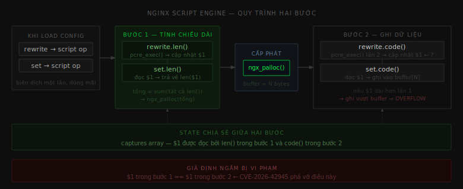
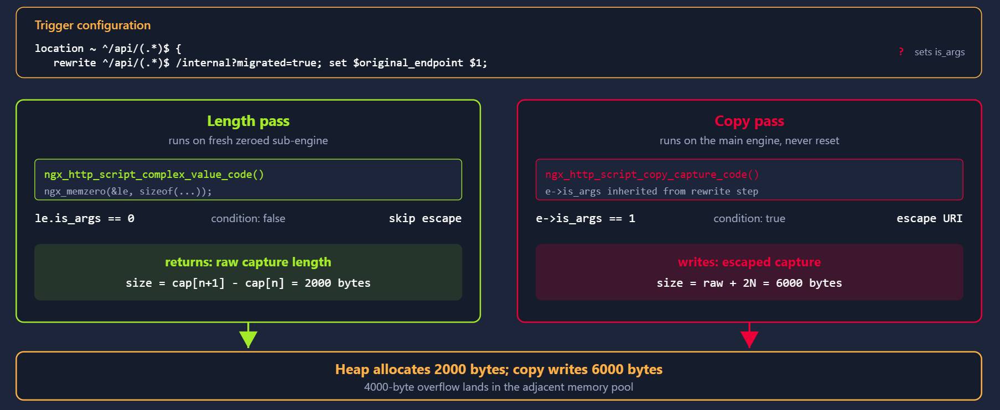
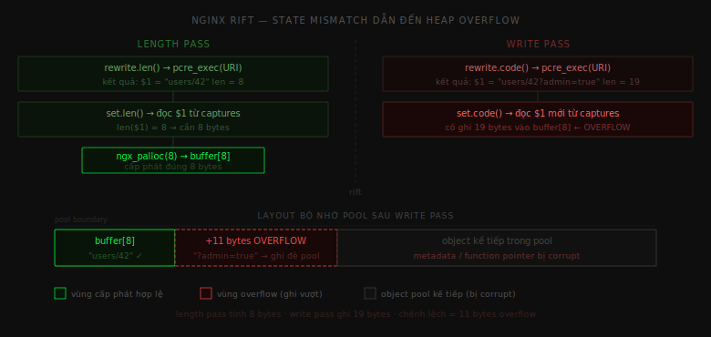
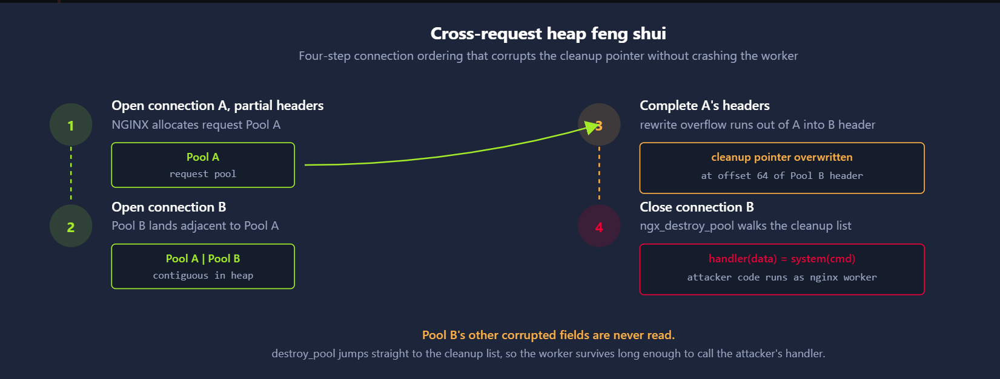

# Nginx Rift

CVE ID       : CVE-2026-42945
Ngày công bố : 08/04/2026
Phần mềm     : nginx
Loại lỗ hổng : Heap buffer overflow / Script engine state desync (CWE-122)
Tác động     : Remote Code Execution (RCE)
CVSS Score   : 9.8 / 10 - CRITICAL
Nguồn        : <https://nvd.nist.gov/vuln/detail/CVE-2026-42945>
PoC          : <https://github.com/v12-security/pocs/tree/main/nginx-rift>
Lab          : <https://tryhackme.com/room/cve202642945>

---

## Nginx Rift là gì?

**Nginx Rift** là lỗ hổng heap buffer overflow trong script engine của nginx, sinh ra từ tổ hợp hai chỉ thị cấu hình phổ biến: `rewrite` và `set`. Khi nginx biên dịch tổ hợp này, nó dùng cơ chế hai bước để tối ưu cấp phát bộ nhớ: bước đầu tính tổng chiều dài output, bước sau ghi dữ liệu thật. Bug xuất hiện khi trạng thái chia sẻ giữa hai chỉ thị — cụ thể là capture group `$1` — thay đổi giữa hai bước. Vùng nhớ đã cấp phát quá nhỏ so với dữ liệu thật được ghi vào, phần pool liền kề bị ghi đè.

Điều đáng chú ý là không cần misconfiguration để trigger lỗi này. Cấu hình `rewrite` + `set` dùng chung capture group — đúng theo tài liệu nginx, phổ biến trong production — là đủ điều kiện.

Các phiên bản bị ảnh hưởng:

| Branch | Phiên bản bị ảnh hưởng | Phiên bản đã vá |
|---|---|---|
| nginx mainline | 1.25.0 đến 1.27.4 | 1.27.5 trở lên |
| nginx stable | 1.24.0 đến 1.26.2 | 1.26.3 trở lên |

Với distro đóng gói nginx riêng (Ubuntu, Debian, RHEL, Alpine...), kiểm tra advisory riêng vì họ backport patch vào package version riêng.

---

## Nền tảng

Hai chỉ thị trọng tâm của CVE này là `rewrite` và `set`. Cả hai đều là các khối cơ bản của cấu hình production và đều có hành vi được xác định rõ ràng, ghi chép đầy đủ. Phần này mô tả chức năng của từng chỉ thị và lý do chúng thường đi cùng nhau, trước khi chỉ ra cách tổ hợp này tạo ra lỗi trong cơ chế thực thi nội bộ của nginx.

### Chỉ thị `rewrite`

`rewrite` sửa đổi URI yêu cầu dựa trên việc khớp với biểu thức chính quy. Khi nginx khớp URI với pattern, chỉ thị thay thế URI bằng một chuỗi mới. Một cấu hình điển hình viết lại tất cả các path vào `/api/` thành path phụ trợ có phiên bản:

```nginx
location ~ ^/api/(.*)$ {
    rewrite ^/api/(.*)$ /v2/api/$1;
}
```

Yêu cầu `/api/users/42` được viết lại nội bộ thành `/v2/api/users/42` trước khi nginx chuyển tiếp đi xử lý tiếp. Chuỗi `$1` trong phần thay thế là backreference đến nhóm bắt đầu tiên trong pattern — phần được đặt trong ngoặc đơn. nginx hỗ trợ cú pháp bắt PCRE tiêu chuẩn; các phần bắt không có tên mặc định có dạng `$1`, `$2`...

Có một hành vi tinh tế quan trọng: nếu chuỗi thay thế chứa dấu chấm hỏi, nginx sẽ coi mọi thứ sau dấu đó là một query string mới và loại bỏ các argument ban đầu của yêu cầu. Chuỗi thay thế `/internal?migrated=true` sẽ viết lại path thành `/internal` và thay toàn bộ query string bằng `migrated=true`. Đây là cách được ghi nhận để loại bỏ hoặc viết lại tham số URL trong quá trình chuẩn hóa.

### Chỉ thị `set`

`set` gán một giá trị cho một biến tùy chỉnh mà nginx duy trì trong suốt thời gian xử lý request. Giá trị đó có thể là hằng số, biến khác, hoặc backreference đến kết quả regex gần nhất. Các biến được định nghĩa bằng `set` thường dùng để giữ thông tin có thể bị mất trong quá trình rewrite — hoặc để tạo giá trị dùng sau này trong proxy header, format log, hay quyết định routing tiếp theo.

Một pattern phổ biến là lưu path gốc vào biến để backend và access log vẫn thấy được client thật sự yêu cầu gì:

```nginx
location ~ ^/api/(.*)$ {
    rewrite ^/api/(.*)$ /internal?migrated=true;
    set $original_endpoint $1;
}
```

`set` chạy sau `rewrite`, và backreference `$1` vẫn trỏ đến phần bắt từ biểu thức chính quy của `rewrite` — path gốc sau `/api/`. Hai chỉ thị thực hiện hai thao tác liên quan đến cùng một capture group, theo thứ tự được ghi chép và hỗ trợ.

Cấu hình trên cũng thể hiện hành vi tinh tế đã đề cập: phần `?migrated=true` trong chuỗi thay thế khiến nginx xử lý `migrated=true` như query string mới. Bên dưới, điều này đặt flag `is_args` trong trạng thái script engine — và chính flag đó là nguồn gốc của lỗ hổng.

### Cơ chế hai bước của script engine

Về bản chất, nginx không diễn giải bất kỳ chỉ thị nào tại thời điểm request. Cả hai chỉ thị được biên dịch khi load config thành một chuỗi các operation trong script engine nội bộ (`ngx_http_script.c`). Mỗi operation có hai hàm: `len()` để tính chiều dài output và `code()` để ghi dữ liệu thật.

Khi request đến và nginx cần tính giá trị của các biến trong chuỗi script, engine thực thi theo hai bước tuần tự:

**Bước 1 — Tính chiều dài:** Engine duyệt qua tất cả operation, gọi `len()` cho từng cái. Mỗi `len()` đọc trạng thái hiện tại — giá trị biến, capture group — và trả về số byte cần để biểu diễn output của nó. Engine cộng tất cả lại và cấp phát một vùng nhớ đúng bằng tổng đó từ pool của request.

**Bước 2 — Ghi dữ liệu:** Engine duyệt lại qua tất cả operation theo cùng thứ tự, gọi `code()` cho từng cái. Mỗi `code()` đọc trạng thái hiện tại và ghi dữ liệu thật vào vùng nhớ đã cấp phát.



Thiết kế này hiệu quả vì tránh phân bổ nhỏ lặp đi lặp lại, nhưng nó phụ thuộc vào việc tính toán chiều dài trong bước đầu tiên phải khớp chính xác với dữ liệu được ghi trong bước thứ hai. Sự không khớp trạng thái làm phá vỡ giả định này là nguồn gốc của lỗ hổng.

---

## Lỗ hổng nằm ở đâu?

Root cause là flag `is_args` có giá trị khác nhau giữa length pass và copy pass của script engine.

Trong config trigger:

```nginx
rewrite ^/api/(.*)$ /internal?migrated=true;
set $original_endpoint $1;
```

Dấu `?` trong chuỗi thay thế báo hiệu cho nginx rằng phần sau nó là query string mới. Khi rewrite xử lý điều này, nó đặt `e->is_args = 1` trên engine chính — flag này thông báo "URI hiện tại có query string". Sau khi rewrite xong, `e->is_args` mang giá trị đó suốt phần còn lại của request.

**Length pass — `ngx_http_script_complex_value_code()`:** Hàm này tính chiều dài cho `$1`. Trước khi chạy, nginx khởi tạo sub-engine riêng bằng `ngx_memzero(&le, sizeof(le))` — tức là zeroed hoàn toàn, `le.is_args = 0`. Trong code tính chiều dài:

```c
if (le.is_args) {
    /* URI-escape: mỗi byte nguy hiểm → %XX (3 bytes) */
}
```

Điều kiện này false. Engine bỏ qua URI escaping, trả về chiều dài thô của capture: giả sử `$1` dài 2000 bytes thì báo cáo 2000. `ngx_palloc(2000)` được gọi.

**Copy pass — `ngx_http_script_copy_capture_code()`:** Hàm này thật sự ghi `$1` vào buffer. Lần này không có sub-engine mới — code chạy trực tiếp trên engine chính `e`, nơi `e->is_args = 1` vẫn còn đó từ bước rewrite:

```c
if (e->is_args) {
    /* URI-escape: mỗi byte nguy hiểm → %XX (3 bytes) */
}
```

Điều kiện này true. Engine percent-encode từng byte cần escape. Cùng 2000 bytes capture đó giờ được ghi dưới dạng escaped: 6000 bytes vào buffer 2000 bytes. 4000 bytes tràn vào phần pool liền kề.





Phần pool liền kề thường là metadata của object tiếp theo — con trỏ, cờ trạng thái, hoặc function pointer. Khi nginx sau đó cố dùng object đó, nó đọc dữ liệu attacker kiểm soát.

---

## Điều kiện để khai thác

Lỗ hổng yêu cầu server có cấu hình `rewrite` + `set` dùng chung capture group trong cùng location block — tổ hợp rất phổ biến trong cấu hình routing API production. Không cần xác thực, không cần tài khoản, không cần biết nội dung ứng dụng phía sau.

Điều không cần: không cần race condition phụ thuộc timing, không cần bypass bất kỳ cơ chế bảo mật tầng ứng dụng nào. Cấu hình đúng chuẩn tài liệu nginx là đủ để tạo ra điều kiện trigger.

Nếu nginx đứng sau CDN hoặc load balancer và thứ đó normalize URI trước khi forward, khả năng khai thác phụ thuộc vào việc normalization đó có vô hiệu hóa payload trigger không. Trong nhiều deployment nginx nhận traffic trực tiếp hoặc chỉ đứng sau TLS terminator không sửa URI, attack vector vẫn mở.

---

## Cơ chế khai thác

### Bước 1 — Xác định cấu hình target

Attacker cần xác nhận server đang chạy nginx trong range bị ảnh hưởng với cấu hình `rewrite` + `set`. Server header (`nginx/1.27.x`) cho biết version. Hành vi rewriting quan sát được qua response — đặc biệt nếu server trả về header `X-Original-Endpoint` hay tương đương — xác nhận pattern cấu hình.

### Bước 2 — Craft URI trigger mismatch

Phần cốt lõi của exploit là gửi URI mà capture group `$1` chứa nhiều ký tự cần URI-escape — khoảng trắng, dấu ngoặc, ký tự ngoài ASCII. Length pass không escape chúng (vì `le.is_args = 0`), báo kích thước thô N bytes. Copy pass escape tất cả (vì `e->is_args = 1`), ghi 3N bytes vào buffer N bytes.

Mỗi ký tự cần escape đóng góp thêm 2 bytes vào khoảng chênh lệch. PoC nhồi `$1` với payload dài chứa toàn ký tự cần escape để tạo ra chênh lệch đủ lớn ghi đè object liền kề một cách có kiểm soát.

### Bước 3 — Chọn mục tiêu: cleanup list trong `ngx_pool_t`

Heap overflow đơn thuần không phải thực thi mã. Để biến overflow thành thứ gì hữu ích, attacker cần ghi đè lên thứ gì đó mà tiến trình sẽ sau đó dùng như một con trỏ — lý tưởng nhất là function pointer. Cơ chế quản lý bộ nhớ của chính nginx cung cấp mục tiêu đó.

Nginx cấp phát bộ nhớ qua per-request pool, biểu diễn bằng `ngx_pool_t`. Mỗi pool theo dõi con trỏ cấp phát hiện tại, danh sách các allocation lớn, và một linked list các cleanup callback. Linked list này là thứ liên quan. Mỗi entry là một `ngx_pool_cleanup_t` chứa `handler` (function pointer) và `data` (argument pointer). Khi pool bị hủy, nginx duyệt qua danh sách và gọi `handler(data)` cho từng entry. Nếu attacker kiểm soát được danh sách cleanup, họ kiểm soát function pointer và argument — và `system()` với chuỗi lệnh do attacker cung cấp là lựa chọn tự nhiên.

Con trỏ `cleanup` nằm ở offset 64 bên trong `ngx_pool_t`, sau một số field trước đó. Đây là vấn đề: overflow liên tục sẽ làm hỏng tất cả các field trên đường đến `cleanup` pointer. Nếu pool bị hỏng còn được dùng cho bất kỳ allocation, đọc mạng, hay xử lý request nào trước khi bị hủy, nginx truy cập một trong những field đó và worker crash ngay — trước khi đến giai đoạn cleanup.

Ràng buộc này đặt ra yêu cầu rõ ràng: attacker phải làm hỏng `cleanup` pointer và ngay sau đó trigger hủy pool, trước khi bất kỳ field hỏng nào khác bị đụng đến.

### Bước 4 — Chuỗi tấn công 4 giai đoạn

PoC được công bố dàn dựng theo 4 giai đoạn để thỏa mãn ràng buộc đó.

**Giai đoạn 1:** Attacker mở kết nối đầu tiên và chỉ gửi một phần HTTP header. Nginx cấp phát request pool cho kết nối này nhưng chưa bắt đầu xử lý request — pool tồn tại, chưa dùng gì thêm.

**Giai đoạn 2:** Ngay sau đó, kết nối thứ hai được mở. Pool allocator đặt pool của kết nối thứ hai ngay cạnh pool đầu tiên. Bố cục lúc này: `[pool 1][pool 2]`.

**Giai đoạn 3:** Attacker hoàn thiện headers của kết nối đầu tiên theo cách trigger lỗi overflow. Overflow đi từ buffer bên trong pool 1 vào header của pool 2 — cụ thể là ghi đè `cleanup` pointer trong `ngx_pool_t` của pool 2 thành địa chỉ của fake `ngx_pool_cleanup_t` do attacker kiểm soát.

**Giai đoạn 4:** Attacker đóng kết nối thứ hai. Nginx gọi `ngx_destroy_pool` cho pool 2. Đường dẫn hủy đọc `cleanup` pointer đã bị ghi đè, tìm đến fake struct của attacker, gọi `handler(data)`. Vì pool 2 bị đóng ngay lập tức mà không xử lý thêm gì, không có field hỏng nào khác bị đụng đến trước đó — và `system(cmd)` được gọi.



### Bước 5 — Bypass URI encoding bằng POST body spray

Còn một vấn đề nữa phải giải quyết: các byte được ghi bởi overflow đến từ URI request, nên phải tồn tại qua URI encoding. Ký tự đặc biệt trong URI bị percent-encode trước khi đến nginx script engine. Attacker không thể ghi một 64-bit pointer hoàn toàn tùy ý chỉ bằng URI.

PoC giải quyết bằng hai kỹ thuật phối hợp.

**Heap layout xác định:** Mỗi nginx worker được `fork()` từ worker cha và kế thừa bố cục địa chỉ của nó. Vị trí của bất kỳ struct nào được spray vào bộ nhớ có thể dự đoán được qua các lần restart. Attacker lập bản đồ vị trí các ứng viên trước, rồi chọn low byte phù hợp để ghi đè qua overflow.

**Spray `ngx_pool_cleanup_t` giả qua POST body:** Header và URI bị nginx encode trước khi xử lý, nhưng body của HTTP POST request được chuyển vào bộ nhớ worker dưới dạng byte thô. Attacker spray hàng nghìn fake `ngx_pool_cleanup_t` struct — với `handler` trỏ đến `system()` và `data` trỏ đến chuỗi lệnh — bằng cách đặt chúng vào POST body. POST body không qua encoding, nên con trỏ nhị phân thực sự bao gồm null byte đều vào bộ nhớ nguyên vẹn.

Kết hợp heap layout xác định, nginx worker tự restart sau crash, và hàng nghìn ứng viên đã spray khiến vét cạn hội tụ nhanh. Attacker retry exploit, mỗi lần thử low-byte overwrite khác nhau để redirect `cleanup` pointer đến một trong các fake struct đã spray — đến khi khớp.

### Giới hạn: ASLR và fallback DoS

**ASLR:** PoC được công bố chứng minh RCE chỉ khi ASLR bị tắt ở cấp OS. Khi ASLR bật, địa chỉ cơ sở toàn tiến trình thay đổi qua mỗi lần spawn, và các con trỏ được spray cần phải được discover trước khi dùng. Về lý thuyết, ghi đè từng byte của `cleanup` pointer có thể dùng để rò rỉ ASLR qua nhiều lần thử, nhưng bước đó không có trong PoC đã công bố.

**DoS không cần ASLR:** Overflow vẫn là phương thức tấn công DoS đáng tin cậy kể cả khi ASLR bật. Bất kỳ request nào khớp với cấu hình dễ bị tổn thương và chứa chuỗi ký tự cần escape đủ dài đều làm hỏng heap và crash worker. Một vòng lặp nhỏ các request như vậy khiến nginx liên tục restart — và web server phía trước bị ngoại tuyến.

---

## Phân tích sâu script engine

Hiểu rõ cơ chế hai bước giúp giải thích tại sao bug này khó phát hiện qua code review và tại sao nó chỉ manifest với input đặc biệt.

### Cách `rewrite` và `set` được biên dịch

Khi nginx parse config, mỗi chỉ thị được handler riêng xử lý:

```text
ngx_http_rewrite()    → biên dịch rewrite thành script operations
ngx_http_set_var()    → biên dịch set thành script operations
```

Cả hai append operation vào cùng script array của location block. Khi request vào location đó, `ngx_http_rewrite_handler()` chạy toàn bộ script array theo thứ tự — trước tiên tất cả `len()`, sau đó tất cả `code()`.

### Shared state là nguồn gốc của vấn đề

Flag `is_args` là shared state bị đọc khác nhau giữa length pass và copy pass.

`ngx_http_script_complex_value_code()` — hàm tính chiều dài — chạy với sub-engine `le` được `ngx_memzero()` về zero trước khi dùng. `le.is_args` luôn bằng 0 ở đây.

`ngx_http_script_copy_capture_code()` — hàm ghi thật — chạy trực tiếp trên engine chính `e`. Và `e->is_args` đã bị `rewrite` đặt thành 1 trước đó (do có `?` trong replacement string).

Cả hai hàm có code path xét `is_args` để quyết định có URI-escape hay không. Cùng một dữ liệu đầu vào, nhưng length pass bỏ qua escape còn copy pass áp dụng escape → chiều dài tính và chiều dài ghi không khớp nhau.

### Tại sao không bị phát hiện sớm hơn

Tổ hợp `rewrite` + `set` hoạt động đúng với tuyệt đại đa số cấu hình. Chỉ khi replacement string của `rewrite` chứa `?` — tức là viết lại kèm query string — thì `is_args` mới được đặt. Đây là pattern hoàn toàn hợp lệ và có trong rất nhiều cấu hình production.

Thêm vào đó, overflow xảy ra trong nginx pool — không trực tiếp trên heap global. Pool corruption thường dẫn đến crash bất định hoặc behavior lạ không có error message rõ ràng, làm khó kết nối triệu chứng với root cause.

Và điều quan trọng nhất: cả `rewrite` lẫn `set` lẫn `ngx_http_script_complex_value_code()` lẫn `ngx_http_script_copy_capture_code()` đều đúng khi xét riêng. Lỗi nằm ở chỗ length function khởi tạo sub-engine riêng với `ngx_memzero()` trong khi copy function chạy trực tiếp trên engine chính. Hai hàm cùng xét `is_args` nhưng đọc từ hai engine với giá trị khác nhau — giả định ngầm rằng chúng sẽ giống nhau là thứ bị CVE-2026-42945 phá vỡ.

---

## Phát hiện

Nginx Rift không để lại dấu trong access log vì request craft thường trông như request bình thường đến location `/api/*`. Trong giai đoạn grooming, request là request hợp lệ. Chỉ đến khi trigger thì worker có thể crash.

**nginx error log**

```text
[crit] 1234#0: *567 worker process 1235 exited on signal 11 (SIGSEGV)
[notice] 1234#0: start worker processes
```

Một lần crash không kết luận được gì. Pattern đáng lo là nhiều worker crash trong thời gian ngắn, đặc biệt ngay sau traffic tăng từ một nguồn đến cùng location.

**Auditd**

```bash
auditctl -a always,exit -F arch=b64 -S kill -F a1=11 -F comm=nginx -k nginx_sigsegv
auditctl -a always,exit -F arch=b64 -S execve -F ppid=$(pgrep -f "nginx: master") -k nginx_child_execve
```

Rule thứ hai bắt `execve()` từ child của nginx master — dấu hiệu rõ nhất của RCE thành công, vì nginx worker bình thường không spawn process con.

**Falco rule tham khảo**

```yaml
- rule: Nginx worker unexpected child process
  desc: Detect unexpected child spawned from nginx worker
  condition: >
    evt.type = execve and
    proc.pname = nginx and
    not proc.cmdline startswith "nginx:"
  output: >
    Unexpected child from nginx worker
    (user=%user.name pid=%proc.pid cmdline=%proc.cmdline
     parent=%proc.pname container=%container.id)
  priority: CRITICAL
  tags: [host, rce, exploit, cve_2026_42945]
```

**Access log pattern**

Nếu log đủ chi tiết, tìm:
- Nhiều request từ cùng IP đến location có `rewrite` + `set`, với URI pattern bất thường
- Batch request response 5xx hoặc không có response (grooming phase)
- Worker respawn ngay sau đó

**MITRE ATT&CK**

| Kỹ thuật | MITRE ID | Nơi xuất hiện |
|---|---|---|
| Exploit Public-Facing Application | T1190 | nginx HTTP/HTTPS endpoint |
| Exploitation for Client Execution | T1203 | heap overflow trong nginx worker |
| Command and Scripting Interpreter | T1059 | shell sau khi overwrite function pointer |

---

## Khắc phục

### Kiểm tra ngay

```bash
nginx -v
```

Kiểm tra config có tổ hợp `rewrite` + `set` dùng chung capture trong cùng location:

```bash
nginx -T 2>/dev/null | grep -A3 'rewrite.*\$[0-9]' | grep 'set.*\$[0-9]'
```

Nếu version trong range bị ảnh hưởng và config có tổ hợp này, cần vá ngay.

### Nâng cấp

Ubuntu/Debian từ nginx official repo:

```bash
sudo apt update && sudo apt install nginx
nginx -v
sudo nginx -s reload
```

RHEL/Alma/Rocky:

```bash
sudo dnf update nginx
sudo nginx -s reload
```

Build từ source:

```bash
git -C nginx pull
./configure [your-flags]
make && sudo make install
sudo nginx -s reload
```

Sau reload, nginx graceful reload fork worker mới với binary đã vá trong khi worker cũ xử lý xong connection còn lại.

### Workaround tạm thời

Nếu chưa có package vá, có thể tách phụ thuộc giữa `set` và captures của `rewrite` bằng cách đọc `$1` vào biến riêng trước khi `rewrite` chạy:

```nginx
location ~ ^/api/(.*)$ {
    set $captured $1;                       # đọc $1 từ location regex (trước khi rewrite)
    rewrite ^/api/(.*)$ /v2/api/$1;
    set $original_endpoint $captured;       # dùng biến đã lưu, không dùng captures của rewrite
}
```

Workaround này chưa được verify chính thức là ngăn mọi variant. Nâng cấp là cách duy nhất an toàn.

---

## Timeline

| Thời điểm | Sự kiện |
|---|---|
| 02/04/2026 | Researcher báo cáo lỗ hổng cho nginx security team qua security@nginx.com |
| 08/04/2026 | nginx phát hành 1.27.5 (mainline) và 1.26.3 (stable) |
| 08/04/2026 | CVE-2026-42945 được công bố |
| 10/04/2026 | PoC công khai xuất hiện |
| 04/2026 | Các distro tiếp tục phát hành package vá |

---

## Bài học rút ra

Nginx Rift là loại lỗi khó nhất để bắt: không có gì sai trong từng chỉ thị riêng lẻ, không có gì sai trong cấu hình, không có gì sai trong tài liệu. Lỗi nằm trong một giả định ngầm của cơ chế tối ưu hiệu năng — rằng shared state không thay đổi giữa hai bước của một pipeline tính toán.

Cơ chế hai bước là lựa chọn kỹ thuật hợp lý: tránh phân bổ nhỏ lặp đi lặp lại, giảm fragmentation, tăng throughput. Nhưng cái giá là tạo ra một dependency ngầm giữa hai lần đọc cùng một giá trị ở hai thời điểm khác nhau trong pipeline. Khi có bất cứ thứ gì làm giá trị đó thay đổi giữa hai lần — dù nhỏ — buffer overflow xảy ra.

Đây là một nhắc nhở rằng bug không phải lúc nào cũng nằm ở nơi người ta tìm: không phải trong authentication, không phải trong parser input, không phải trong logic nghiệp vụ. Đôi khi nó nằm trong chính cơ chế tối ưu hóa giúp server hoạt động nhanh. Và những bug ở lớp đó thường tồn tại lâu nhất vì không ai nghĩ đến việc kiểm tra chúng.

---

*Nguồn tham khảo: [NVD - CVE-2026-42945](https://nvd.nist.gov/vuln/detail/CVE-2026-42945) | [nginx security advisories](https://nginx.org/en/security_advisories.html) | [v12-security PoC](https://github.com/v12-security/pocs/tree/main/nginx-rift)*
