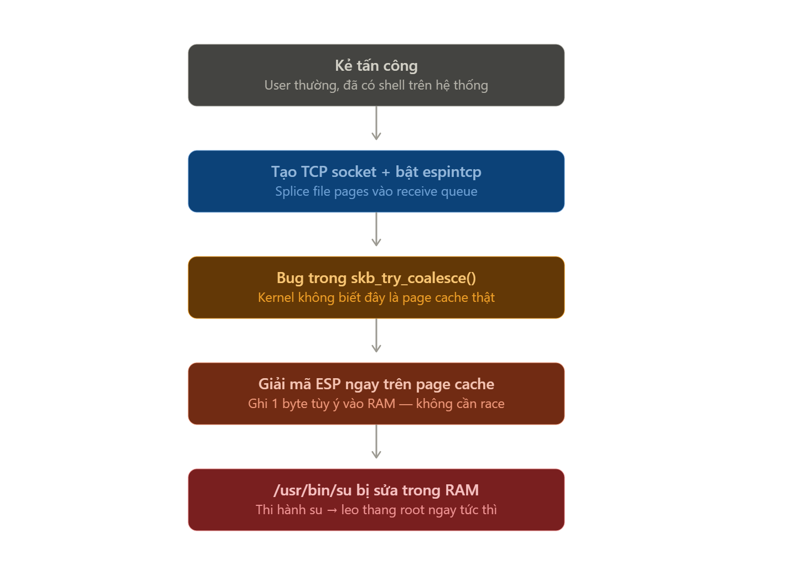
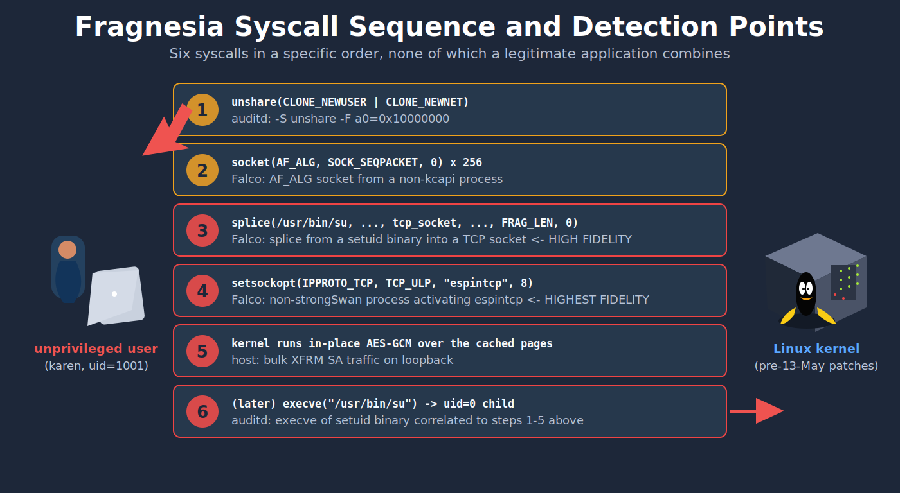

# Fragnesia

[CVE](../README.md)

CVE ID       : CVE-2026-46300
Ngày công bố : 13/05/2026
Phần mềm     : Linux kernel
Loại lỗ hổng : Page-cache write / Write-what-where (CWE-123)
Tác động     : Local Privilege Escalation (root)
CVSS Score   : 7.8 / 10 - HIGH
Nguồn        : <https://nvd.nist.gov/vuln/detail/CVE-2026-46300>
PoC          : <https://github.com/v12-security/pocs/tree/main/fragnesia>
Lab          : <https://tryhackme.com/room/cve202646300>

---

## Fragnesia là gì?

- **Fragnesia** là một lỗ hổng leo thang đặc quyền cục bộ trong **Linux kernel**, nằm ở vùng xử lý **network buffer** của **XFRM/ESP-in-TCP**. Một user bình thường trên máy Linux có thể lợi dụng lỗi này để ghi dữ liệu vào **page cache** của file chỉ đọc, từ đó biến một binary hệ thống như `/usr/bin/su` thành thứ khác trong bộ nhớ và chạy nó với quyền root.

- File thật trên disk không bị sửa. Nội dung bị thay đổi nằm trong page cache — lớp cache mà kernel dùng để tăng tốc đọc file. Nhìn bằng `ls`, checksum trên disk, hoặc mở file sau khi cache bị xóa có thể vẫn thấy mọi thứ **bình thường**. Nhưng trong khoảng thời gian cache còn bị nhiễm, tiến trình đọc file đó sẽ nhận nội dung đã bị sửa.

- Tên **Fragnesia** có thể hiểu nôm na là "fragment amnesia" — bộ đệm mạng `skb` quên mất rằng một fragment đang được dùng chung. Nghe như một lỗi nhỏ về metadata, nhưng trong kernel, một bit metadata đi lạc có thể trở thành root shell. Lỗ hổng này cùng họ với Dirty Frag / Dirty Pipe — đây **không phải RCE từ xa**, nhưng sau khi đã có foothold user thường thì leo lên root, đọc secret, sửa process runtime, hay thoát container tùy cấu hình đều trong tầm tay.

- Mã CVE này ảnh hưởng đến các kernel branch chưa có bản vá cho `net/core/skbuff.c`. Theo Linux CNA, các nhánh stable đã được đánh dấu an toàn từ:

| Branch | Phiên bản đã vá |
|---|---|
| 5.10.x | 5.10.257 trở lên |
| 5.15.x | 5.15.208 trở lên |
| 6.1.x | 6.1.174 trở lên |
| 6.6.x | 6.6.141 trở lên |
| 6.12.x | 6.12.91 trở lên |
| 6.18.x | 6.18.33 trở lên |
| 7.0.x | 7.0.10 trở lên |
| 7.1+ | đã bao gồm bản vá |

> Với distro thực tế, đừng chỉ nhìn số kernel upstream. Hãy kiểm tra advisory của Ubuntu, Debian, RHEL, AlmaLinux, Rocky, SUSE, Oracle, Amazon Linux... vì họ thường backport patch vào kernel package có version riêng.

> Gợi ý hình: sơ đồ tổng quan `user thường -> namespace -> ESP-in-TCP -> page cache -> /usr/bin/su -> root shell`.

---

## Vì sao LPE vẫn nguy hiểm?

Nhiều người thấy "local privilege escalation" rồi thở phào vì nó không phải unauthenticated RCE. Nhưng trong thực tế, LPE thường là bước thứ hai của một cuộc tấn công.

Kẻ tấn công có thể vào hệ thống bằng một user thấp quyền:

- web shell chạy dưới `www-data`
- tài khoản CI/CD bị lộ token
- container workload không tin cậy
- user SSH bị compromise
- tiến trình app có quyền đọc file nhưng không có quyền root

Nếu kernel còn dính Fragnesia, foothold thấp quyền đó có thể biến thành root. Trên server multi-tenant, runner CI, node Kubernetes, hoặc máy dev có nhiều secret, đây là kiểu lỗi làm một sự cố nhỏ phình thành compromise toàn máy.

Ubuntu cũng đánh giá CVE này là High và mô tả khả năng leo thang đặc quyền cục bộ, thậm chí có thể hỗ trợ container escape trong một số triển khai.

---

## Nền tảng

Trước khi bóc root cause, cần hiểu ba mảnh nhỏ: **page cache**, **sk_buff**, và **ESP-in-TCP**.

### Page cache là gì?

Khi một process đọc `/usr/bin/su`, kernel không nhất thiết đọc từng byte trực tiếp từ disk mỗi lần. Nó đưa nội dung file vào RAM, gọi là **page cache**. Lần sau process khác đọc cùng file, kernel trả dữ liệu từ cache cho nhanh.

Về nguyên tắc:

- File chỉ đọc thì user thường không được sửa.
- Page cache của file chỉ đọc cũng không được bị sửa lung tung.
- Nếu kernel cần ghi vào một buffer đang trỏ tới page cache, nó phải copy sang vùng nhớ riêng trước - đây là tinh thần của copy-on-write.

Fragnesia phá đúng giả định này: kernel tưởng buffer không còn dùng chung với page cache, nên ghi thẳng vào đó.

> Gợi ý hình: minh họa page cache nằm giữa disk và process, file trên disk không đổi nhưng page cache bị sửa.

### `sk_buff` là gì?

Trong Linux kernel, packet mạng được đại diện bằng cấu trúc `sk_buff`, hay thường gọi là `skb`. Một `skb` không nhất thiết chứa toàn bộ dữ liệu trong một mảng liên tục. Nó có thể có nhiều **fragment** - các mảnh dữ liệu trỏ tới những page khác nhau trong bộ nhớ.

Một fragment có thể là:

- dữ liệu do network stack tự cấp phát
- dữ liệu được copy vào vùng riêng
- dữ liệu "mượn" từ nơi khác, ví dụ page cache của một file thông qua `splice()`

Vì vậy kernel cần biết fragment nào là **shared frag** - mảnh đang trỏ tới vùng nhớ được sở hữu bởi nơi khác. Nếu thấy shared frag, các đoạn code ghi dữ liệu tại chỗ phải cẩn thận: copy ra trước rồi mới sửa.

### XFRM, ESP và ESP-in-TCP là gì?

**XFRM** là framework trong Linux kernel để xử lý IPsec. **ESP** (Encapsulating Security Payload) là giao thức dùng để mã hóa/xác thực packet trong IPsec.

Bình thường ESP chạy trực tiếp trên IP. Nhưng có một chế độ gọi là **ESP-in-TCP**, đưa ESP vào trong một kết nối TCP để đi qua NAT/firewall dễ hơn. Trong kernel, chế độ này được bật qua `TCP_ULP` với ULP tên `espintcp`.

Khi ESP nhận packet, nó cần decrypt dữ liệu. Để tối ưu hiệu năng, kernel có lúc decrypt **in-place** - tức là sửa trực tiếp trên buffer hiện có thay vì copy sang buffer mới. Tối ưu này chỉ an toàn nếu buffer đó không trỏ vào page cache của file chỉ đọc.

---

## Lỗ hổng nằm ở đâu?

Root cause nằm trong hàm:

```c
skb_try_coalesce()
```

thuộc file:

```text
net/core/skbuff.c
```

Hàm này có nhiệm vụ gộp dữ liệu từ một `skb` này sang `skb` khác để network stack xử lý hiệu quả hơn. Khi gộp, nó có thể chuyển các paged fragments từ `from` sang `to`.

Vấn đề là: nếu `from` có cờ `SKBFL_SHARED_FRAG`, tức là fragment đang trỏ tới vùng nhớ dùng chung như page cache, thì sau khi chuyển fragment sang `to`, cờ này phải đi theo. Nhưng phiên bản lỗi không làm vậy.

Kết quả:

- `to` vẫn giữ fragment trỏ tới page cache.
- Nhưng metadata lại nói rằng fragment đó **không còn shared**.
- Các đoạn code sau nhìn vào `to` và tin rằng có thể ghi in-place.

Trong đường ESP input, kernel có logic kiểu:

```text
Nếu skb có shared frag:
    copy dữ liệu ra vùng riêng trước khi decrypt
Nếu không:
    decrypt trực tiếp trên buffer hiện tại
```

Fragnesia làm `skb_has_shared_frag()` trả về false trong khi bên trong vẫn đang có page-cache-backed fragment. Vậy là ESP decrypt thẳng vào page cache.

Mấu chốt nằm ở một bit metadata: kernel vẫn cầm page-cache-backed fragment, nhưng lại quên đánh dấu nó là shared.

---

## Điều kiện để khai thác

Lỗ hổng yêu cầu foothold cục bộ trước — kẻ tấn công cần có quyền chạy code trên máy bị ảnh hưởng, kernel có XFRM/ESP-in-TCP khả dụng, và đọc được một setuid-root binary như `/usr/bin/su` làm mục tiêu. Trên hầu hết distro, điều này tương đương user SSH bình thường hoặc tiến trình web shell chạy dưới `www-data`.

Điều không cần là những thứ thường làm LPE khó hơn: không cần quyền root ban đầu, không cần sửa file trên disk, không cần race condition kiểu thắng-thua do timing, không cần chạm vào bất kỳ service nào đang listen ra ngoài internet.

Trên Ubuntu, AppArmor có thể chặn một phần PoC mặc định vì hạn chế unprivileged user namespace. Nhưng đó là lớp giảm thiểu, không phải bản vá root cause. Nếu attacker có vector khác để có namespace/capability phù hợp, hệ thống chưa vá vẫn nên được xem là rủi ro.

---

## Cơ chế khai thác



### Bước 1 - Mượn page cache của file đích

Attacker mở một file có thể đọc được, ví dụ `/usr/bin/su`, rồi dùng `splice()` để đưa dữ liệu từ file vào TCP stream theo cơ chế zero-copy.

Zero-copy nghĩa là kernel cố tránh copy dữ liệu qua lại. Thay vì tạo bản sao mới, nó có thể gắn reference tới page cache của file vào fragment trong `skb`.

Ở đây chính là chỗ nguy hiểm: network buffer đang cầm một mảnh trỏ về page cache của file hệ thống.

### Bước 2 - Làm `skb` quên shared frag

Trong quá trình TCP receive coalescing, `skb_try_coalesce()` gộp các fragment lại. Fragment page-cache-backed được chuyển qua `skb` mới, nhưng cờ `SKBFL_SHARED_FRAG` không được propagate.

Từ thời điểm này, kernel đang cầm một object có nội dung nguy hiểm:

```text
Thực tế     : fragment trỏ tới page cache của file chỉ đọc
Metadata   : fragment trông như không shared
```

Kiểu lỗi này khó chịu ở chỗ dữ liệu thật và metadata an toàn không còn khớp nhau.

### Bước 3 - Bật ESP-in-TCP sau khi dữ liệu đã nằm trong queue

PoC tạo một cặp socket TCP. Dữ liệu file đã được splice vào receive queue trước. Sau đó phía nhận mới bật ULP `espintcp`.

Khi `espintcp` xử lý queue, kernel coi dữ liệu đang nằm đó như ESP ciphertext cần decrypt. Vì marker shared frag đã mất, ESP input tin rằng có thể decrypt trực tiếp trên buffer.

Kết quả: AES-GCM decrypt ghi thẳng lên page cache.

### Bước 4 - Điều khiển byte cần ghi

Mã hóa dạng stream/counter có tính chất XOR: nếu kiểm soát keystream, ta có thể biến byte hiện tại thành byte mong muốn.

PoC xây một bảng tra cứu nonce để chọn keystream byte phù hợp. Mỗi lần trigger sửa được một byte tại vị trí đích. Lặp lại đủ nhiều lần, attacker có thể ghi một payload nhỏ vào page cache của `/usr/bin/su`.

Payload công khai thường nhắm vào phần đầu của binary: ghi một ELF stub nhỏ gọi `setresuid(0,0,0)`, `setresgid(0,0,0)`, rồi `execve("/bin/sh")`.

### Bước 5 - Chạy binary đã bị sửa trong cache

Sau khi page cache của `/usr/bin/su` đã bị sửa, attacker gọi:

```text
execve("/usr/bin/su")
```

Kernel load nội dung từ page cache, không phải đọc lại bản sạch từ disk. Vì `/usr/bin/su` là setuid-root, payload chạy với quyền root và mở shell root.

Điểm nguy hiểm là sau khi drop cache hoặc reboot, file trên disk vẫn là bản gốc. Đây không phải kiểu persistence ghi thẳng vào `/usr/bin/su`, mà là corruption tạm thời trong RAM.

---

## Phân tích sâu script PoC

> PoC: `v12-security/pocs/fragnesia/fragnesia.c`

Đọc PoC này nên bắt đầu từ `main()`, vì nó cho thấy ý đồ thật của script. Phần comment đầu file vẫn nhắc đến chế độ demo trên một file disposable trong `/tmp` hoặc `/var/tmp`, thậm chí còn có `usage()` nhận `<target-file> <offset> <hex-bytes>`. Nhưng trong bản hiện tại, `main()` đã hard-code:

- `target_file = "/usr/bin/su"`
- `byte_off = 0`
- `desired = shell_elf`
- `desired_len = 192`

Tức là đây không còn là demo "đổi vài byte trong file test" nữa. Script nhắm thẳng vào `/usr/bin/su`, ghi một ELF nhỏ 192 byte vào page cache ở offset 0, rồi gọi `execve("/usr/bin/su")`. Nếu máy dính lỗi, thứ được execute không còn là `su` thật trong cache nữa, mà là ELF stub do PoC vừa nhét vào RAM.

> Gợi ý hình: ảnh terminal lúc PoC chạy, tập trung vào các dòng `userns_setup`, `xfrm_espintcp_state_add`, `stream0_table_entries=256`, `smashed`.

### Cấu trúc tổng quan của script

Luồng chính đi như sau:

```text
main()
  -> use_existing_target("/usr/bin/su")
  -> verify_write_denied("outer")
  -> setup_user_netns_xfrm()
  -> verify_write_denied("userns_root_mapped_to_outer_user")
  -> replace_existing_bytes_after(0, shell_elf, 192, file_size)
  -> execve("/usr/bin/su")
```

Hai lần `verify_write_denied()` là chi tiết đáng để ý. Script cố mở `/usr/bin/su` với `O_WRONLY`. Nếu mở ghi thành công thì lab sai, vì user đã có quyền ghi file rồi, không chứng minh được gì nữa. PoC muốn chứng minh đúng boundary:

- User thường **không ghi được** `/usr/bin/su` theo permission bình thường.
- Kể cả sau khi vào user namespace và thành `uid=0` bên trong namespace, vẫn **không ghi được** file thật trên host.
- Nhưng vẫn có thể làm kernel ghi vào page cache thông qua đường ESP-in-TCP.

Tức là quyền Unix vẫn chặn đúng, nhưng kernel bug đi vòng qua đường khác.

### `shell_elf` - payload không phải shellcode bình thường

Payload trong PoC là một mảng 192 byte tên `shell_elf`. Nó không phải shellcode được inject vào process đang chạy. Nó là một **ELF executable tối giản**.

Ý tưởng là:

1. Ghi 192 byte đầu của `/usr/bin/su` trong page cache thành ELF mới.
2. ELF này gọi các syscall để set UID/GID về `0`.
3. Sau đó nó gọi `/bin/sh`.
4. Vì `/usr/bin/su` là setuid-root, ELF nhỏ này chạy với quyền root.

Vì vậy PoC chọn `/usr/bin/su`: không cần sửa `/etc/passwd`, không cần ghi authorized_keys, không cần tạo file mới. Chỉ cần làm kernel load "phiên bản trong cache" của một setuid binary đã tồn tại.

> File `/usr/bin/su` trên disk không bị thay đổi. Thứ bị sửa là page cache. Vì vậy sau khi reboot hoặc drop cache, nội dung thật quay lại bình thường.

### `setup_user_netns_xfrm()` - tự dựng một mạng nhỏ để chạm vào XFRM

Phần này là cánh cửa để một user thường chạm vào subsystem mạng sâu của kernel.

**`enter_mapped_userns()`**

PoC fork một child, child gọi:

```text
unshare(CLONE_NEWUSER)
```

Parent đứng ngoài ghi map vào:

```text
/proc/<pid>/uid_map
/proc/<pid>/gid_map
/proc/<pid>/setgroups
```

Sau đó child gọi `setresuid(0,0,0)` và `setresgid(0,0,0)`. Kết quả: trong user namespace, process nhìn như root. Nhưng đây không phải root thật của host. Nó chỉ là root trong namespace vừa tạo.

Chỗ này dễ nhầm: "root trong user namespace" nghe vô hại, nhưng một số kernel subsystem cho phép root trong namespace cấu hình tài nguyên bên trong namespace đó. Nếu subsystem có bug, boundary này thành đường tấn công.

**`unshare(CLONE_NEWNET)` và bật loopback**

Sau user namespace, PoC tạo tiếp network namespace:

```text
unshare(CLONE_NEWNET)
```

Rồi bật interface `lo` bằng `ioctl(SIOCSIFFLAGS)`. Từ đây script có một network stack riêng, loopback riêng, socket riêng. Không cần gói tin đi ra internet. Toàn bộ exploit chạy trên `::1`.

**`add_xfrm_espintcp_state()`**

Đoạn này cài đường đi cho packet vào ESP-in-TCP.

Script tạo một netlink message loại:

```text
XFRM_MSG_NEWSA
```

và gửi qua:

```text
NETLINK_XFRM
```

Security Association được cấu hình với:

- địa chỉ nguồn/đích: `::1`
- SPI: `0x100`
- protocol: `IPPROTO_ESP`
- mode: transport
- thuật toán: `rfc4106(gcm(aes))`
- encapsulation: `TCP_ENCAP_ESPINTCP`
- port: `5556`

Mục tiêu không phải tạo VPN thật. Mục tiêu là làm kernel tin rằng TCP stream trên loopback kia chứa ESP record hợp lệ, để khi bật `espintcp`, kernel gọi đúng đoạn decrypt ESP input.

### `build_stream0_table()` - biến AES-GCM thành bút ghi từng byte

Phần này làm exploit bớt phụ thuộc may rủi.

PoC dùng `AF_ALG` để gọi AES trong kernel. Nó tạo bảng `stream0_nonce[256]`: với mỗi giá trị byte từ `00` đến `ff`, tìm một nonce sao cho byte đầu tiên của keystream AES-GCM bằng đúng giá trị đó.

Luồng tính toán:

```text
salt || IV || counter(2)
        ↓ AES encrypt
keystream block
        ↓ lấy byte đầu tiên
stream[0]
```

Script thử nonce từ `0` đến `0xffff` cho đến khi thu đủ 256 giá trị `stream[0]`.

Tại sao cần bảng này?

Vì khi ESP decrypt, byte trong page cache bị XOR với keystream:

```text
final = current ^ stream
```

Muốn biến `current` thành `desired`, chỉ cần:

```text
stream = current ^ desired
```

Nên mỗi vòng ghi byte làm đúng ba việc:

- đọc byte hiện tại trong file cache
- tính `need_stream = current ^ desired`
- chọn IV/nonce đã biết tạo ra `need_stream`

PoC không "hy vọng" byte bị sửa thành đúng giá trị; nó chọn keystream để byte đầu tiên của vùng decrypt thành đúng giá trị cần ghi.

> Gợi ý hình: bảng nhỏ `current ^ desired = need_stream`, rồi map `need_stream -> nonce -> IV`.

### `receiver()` và `sender()` - chỗ bug thật sự bị kích hoạt

Hai hàm này là trái tim của exploit.

**Receiver - đợi dữ liệu vào queue rồi mới bật `espintcp`**

`receiver()` mở TCP socket IPv6 trên loopback, bind vào port `5556`, rồi `accept()` kết nối từ sender.

Điểm quan trọng là sau khi accept, nó không bật `espintcp` ngay. Nó ngủ một chút:

```text
RECEIVER_PRE_ULP_US = 30000
```

Sau đó mới gọi `setsockopt()` để bật:

```text
TCP_ULP = "espintcp"
```

Tức là dữ liệu đã được sender đẩy vào socket buffer trước, rồi receiver mới bảo kernel: "từ giờ hãy xử lý stream này như ESP-in-TCP".

Đây không phải race condition kiểu hên xui. `usleep()` ở đây chủ yếu để sắp thứ tự: **queue trước, bật ULP sau**.

**Sender - gửi ESP header rồi splice file vào TCP**

`sender()` dựng một prefix gồm:

- độ dài ESP-in-TCP
- ESP header
- SPI `0x100`
- sequence number
- IV đã chọn từ bảng keystream

Sau đó nó mở `/usr/bin/su` ở chế độ read-only. Không có ghi file ở đây.

Phần quan trọng nhất:

```text
splice(file -> pipe)
splice(pipe -> tcp socket)
```

Tại sao phải đi vòng qua pipe?

Vì đây là đường zero-copy quen thuộc của Linux. Kernel có thể đưa page cache của file vào `skb` dưới dạng fragment, thay vì copy byte vào buffer mới. Chính reference tới page cache này là thứ exploit cần.

Sau khi sender gửi prefix và splice 4096 byte từ file vào TCP stream, receiver bật `espintcp`. Kernel nhìn vào stream, thấy ESP record, rồi decrypt in-place trên buffer đang trỏ về page cache.

Nếu kernel chưa vá, marker `SKBFL_SHARED_FRAG` đã bị rơi trong quá trình coalescing, nên ESP không gọi copy-on-write. Nó ghi thẳng vào page cache.

### `run_trigger_pair()` - một lần bắn cho một byte

`run_trigger_pair()` chỉ làm nhiệm vụ orchestration:

- tạo pipe đồng bộ
- fork receiver
- fork sender
- chờ cả hai kết thúc
- nếu sender/receiver fail thì trả lỗi

Mỗi lần gọi hàm này là một lần "bắn" ESP-in-TCP trigger. Trong điều kiện kernel vulnerable, byte đầu tiên tại `target_splice_off` sẽ bị XOR theo keystream đã chọn.

Không có vòng flood hàng chục nghìn request như bài Tomcat. Fragnesia không cần tạo bão request. Nó cần một primitive đúng đường và lặp lại có kiểm soát.

### `replace_existing_bytes_after()` - ghi 192 byte vào page cache

Vòng lặp này dùng để biến `/usr/bin/su` trong cache thành `shell_elf`.

Trước khi ghi, PoC kiểm tra range:

```text
offset + payload_len phải nằm trong file
payload không được nằm quá gần EOF
```

Lý do là mỗi trigger splice/decrypt một vùng 4096 byte. PoC gọi chế độ này là `collateral-after`: byte cần sửa nằm ở đầu vùng transform, còn các byte phía sau có thể bị ảnh hưởng theo. Với `/usr/bin/su`, PoC chỉ cần phần đầu file trở thành ELF stub hợp lệ; vùng bị nhiễu phía sau không còn quan trọng nếu ELF mới đã tự mô tả segment cần load.

Vòng lặp từng byte:

```text
for idx in payload:
    current = read byte ở /usr/bin/su + idx
    nếu current == desired:
        skip
    need_stream = current ^ desired
    choose_iv_for_stream0(need_stream)
    active_esp_seq++
    run_trigger_pair()
    final = đọc lại byte
    nếu final == desired:
        thành công
    nếu final == current:
        kernel đã vá / không bị sửa
    nếu final khác cả hai:
        primitive không ổn định
```

Có hai điểm cần để ý:

- Script đọc lại file bằng `pread()` sau mỗi trigger. Nếu page cache bị sửa, lần đọc tiếp theo trả về byte mới ngay cả khi file trên disk không đổi.
- Nếu byte không đổi, PoC coi đó là "fixed behavior" - kernel đã copy-on-write đúng hoặc marker shared frag không bị mất.

Vì vậy PoC không chỉ exploit; nó còn tự đóng vai trò oracle kiểm tra kernel vulnerable hay đã vá.

### Tại sao `execve("/usr/bin/su")` ở cuối lại ăn root?

Sau khi 192 byte đầu đã khớp `shell_elf`, script gọi:

```text
execve("/usr/bin/su")
```

Kernel chuẩn bị chạy `/usr/bin/su`, nhưng dữ liệu nó đọc đang đến từ page cache đã bị thay. Vì file này là setuid-root, payload ELF nhỏ chạy với effective UID root.

Luồng này không cần ghi file thật:

```text
permission layer: từ chối ghi /usr/bin/su
page cache    : bị sửa thông qua ESP decrypt
execve        : load nội dung đã bị sửa trong cache
setuid bit    : nâng quyền payload lên root
```

Về bản chất, đây là điểm Fragnesia giống Dirty Pipe: quyền file nói "không được ghi", nhưng kernel lại vô tình ghi hộ attacker vào cache.

### Vì sao đây không phải race condition?

Nhìn thấy `usleep()` trong sender/receiver dễ tưởng đây là race condition. Nhưng nó khác Tomcat.

Trong Tomcat, phải spam request để hy vọng rơi đúng khoảng TOCTOU. Còn ở đây, PoC có trình tự khá deterministic:

1. Sender gửi ESP prefix.
2. Sender splice page cache của file vào TCP stream.
3. Receiver bật `espintcp` sau khi dữ liệu đã nằm trong queue.
4. ESP input decrypt in-place.
5. Byte đầu tiên bị sửa theo IV đã chọn.

`usleep()` chỉ để làm các bước trên diễn ra đúng thứ tự trong môi trường thực tế. Nếu kernel vulnerable, một trigger pair có thể sửa đúng byte. Nếu kernel đã vá, byte giữ nguyên.

### Dấu vết khi chạy PoC

Output của PoC cũng cho biết nó đang đi tới đâu:

- `outer_write_open_denied=1` - user thường không ghi được target.
- `userns_setup` - đã vào user namespace và map UID/GID.
- `netns_setup=1` - đã tạo network namespace.
- `loopback_up=1` - loopback trong namespace đã bật.
- `xfrm_espintcp_state_add=1` - XFRM SA đã được cài.
- `stream0_table_entries=256` - bảng nonce đã đủ 256 byte.
- `firing espintcp splice...` - đang kích hoạt sender/receiver.
- `smashed xx -> yy` - một byte trong page cache đã bị đổi.

Nếu thấy `fixed behavior: byte unchanged`, đó là dấu hiệu tốt: kernel không còn decrypt in-place lên shared page cache nữa.

> Sau khi test trong lab, cần drop cache hoặc reboot. Nếu không, bản `/usr/bin/su` trong page cache vẫn còn payload và những lần chạy `su` tiếp theo có thể tiếp tục đi vào nội dung đã bị sửa.

---

## Vì sao bản vá nhỏ nhưng quan trọng?

Patch upstream cho nhánh này chỉ vài dòng. Ý tưởng chính là: khi chuyển fragment từ `from` sang `to`, nếu fragment có cờ shared thì cờ đó phải đi theo.

```c
if (from_shinfo->nr_frags)
    to_shinfo->flags |= from_shinfo->flags & SKBFL_SHARED_FRAG;
```

Hai dòng này khôi phục invariant bảo mật:

- Fragment trỏ tới page cache thì phải được đánh dấu là shared.
- Code nào muốn ghi in-place phải nhìn thấy marker đó.
- ESP input sẽ gọi copy-on-write khi cần, thay vì decrypt thẳng lên page cache.

Điểm cần rút ra: trong kernel, "metadata phụ" nhiều khi chính là hàng rào bảo mật. Một bit flag bị rơi giữa pipeline có thể làm các lớp phía sau đưa ra quyết định sai hoàn toàn.

> Gợi ý hình: diff patch 2 dòng trong `skb_try_coalesce()` hoặc sơ đồ trước/sau khi propagate `SKBFL_SHARED_FRAG`.

---

## Phát hiện

Fragnesia khó phát hiện hơn web shell vì nó không nhất thiết tạo file lạ trên disk. Nhưng exploit lại để lộ một chuỗi syscall khá đặc trưng. Một tín hiệu đơn lẻ đã đáng nghi; nhiều tín hiệu xuất hiện liên tiếp trong cùng process/cgroup trong vài giây thì gần như là mô hình khai thác.

Chuỗi cần theo dõi:

```text
unshare(CLONE_NEWUSER / CLONE_NEWNET)
    -> ghi uid_map/gid_map
    -> socket(AF_ALG, ...)
    -> NETLINK_XFRM / XFRM_MSG_NEWSA
    -> splice(setuid binary -> TCP socket)
    -> setsockopt(TCP_ULP, "espintcp")
    -> execve("/usr/bin/su")
    -> process con có euid=0
```



### Tín hiệu chính

**`setsockopt(TCP_ULP, "espintcp")`**

Tín hiệu đơn có độ chính xác cao nhất là `setsockopt(TCP_ULP, "espintcp")`. Việc dùng `espintcp` hợp pháp khá hiếm, thường nằm trong nhóm IPsec/IKE daemon như `charon`, `charon-systemd`, `pluto`, `swanctl`. Nếu một process lạ bật `TCP_ULP=espintcp`, cần điều tra ngay.

Nếu process đó vừa `splice()` một setuid binary vào TCP socket trước đó, gần như có thể coi là exploit path:

```text
/usr/bin/su -> splice() -> TCP socket -> setsockopt(TCP_ULP, "espintcp")
```

**`splice()` từ setuid binary sang TCP socket**

PoC cần đưa page cache của file đích vào `skb`. Vì vậy `splice()` từ `/usr/bin/su`, `/bin/su`, `/usr/bin/sudo`, `/usr/bin/passwd`... sang một TCP socket là tín hiệu mạnh.

**`socket(AF_ALG, ...)`**

PoC dùng `AF_ALG` để dựng bảng keystream AES-GCM. `AF_ALG` không xấu mặc định, nhưng nếu process không phải `kcapi-*`, `cryptsetup`, hoặc phần mềm crypto hợp lệ mà lại mở `AF_ALG` ngay trước chuỗi `XFRM + splice + espintcp`, đây là tín hiệu bổ sung.

**`NETLINK_XFRM` / `XFRM_MSG_NEWSA`**

Exploit cần đăng ký XFRM Security Association cho ESP-in-TCP. Một process user thường tự tạo XFRM SA trên loopback, dùng AES-GCM key cố định, rồi bắn nhiều trigger trong thời gian ngắn là bất thường.

### Các syscall cần theo dõi

| Syscall / hành vi | Cần chú ý | Ý nghĩa |
|---|---|---|
| `unshare(CLONE_NEWUSER)` / `unshare(CLONE_NEWNET)` | process không đặc quyền tự tạo namespace | bước chuẩn bị capability trong namespace |
| ghi `/proc/*/uid_map`, `/proc/*/gid_map` | map user thường thành root trong user namespace | mở đường cấu hình network namespace |
| `socket(AF_ALG, SOCK_SEQPACKET, ...)` | process không thuộc nhóm crypto hợp lệ | dựng bảng keystream AES-GCM |
| `NETLINK_XFRM` / `XFRM_MSG_NEWSA` | tạo ESP SA bất thường trên loopback | chuẩn bị đường ESP-in-TCP |
| `splice()` từ setuid binary sang TCP socket | `/usr/bin/su`, `/usr/bin/sudo`, `/usr/bin/passwd`... | đưa page cache vào TCP queue |
| `setsockopt(TCP_ULP, "espintcp")` | process không phải strongSwan/libreswan daemon | tín hiệu riêng của Fragnesia |
| `execve("/usr/bin/su")` | sau chuỗi syscall phía trên, process con có `euid=0` | xác nhận impact |

### Auditd rule tham khảo

Auditd không lọc đẹp được mọi tham số như `TCP_ULP="espintcp"`, nên phần tương quan nên làm ở SIEM hoặc eBPF/Falco. Các rule dưới đây dùng để gom tín hiệu thô:

```bash
auditctl -a always,exit -F arch=b64 -S setsockopt -k fragnesia_setsockopt
auditctl -a always,exit -F arch=b64 -S unshare -k fragnesia_unshare
auditctl -a always,exit -F arch=b64 -S splice -k fragnesia_splice
```

Nếu muốn bắt riêng `CLONE_NEWUSER` giống PoC V12:

```bash
auditctl -a always,exit -F arch=b64 -S unshare -F a0=0x10000000 -k fragnesia_userns
```

Lưu ý: filter `a0=0x10000000` là exact match. Nếu một tool gọi `unshare()` với nhiều flag cùng lúc, nên để SIEM xử lý bitmask thay vì chỉ dựa vào rule này.

Với `splice()`, event có thể nhiều trên server bận. Nếu audit pipeline hỗ trợ lọc theo path hoặc enrich bằng eBPF, ưu tiên các setuid binary:

```text
/usr/bin/su
/bin/su
/usr/bin/sudo
/usr/bin/passwd
/usr/bin/chsh
```

### Falco rule tham khảo

Rule này không thay thế correlation đầy đủ, nhưng bắt được hai tín hiệu mạnh nhất: `splice()` từ setuid binary và bật `espintcp` từ process không nằm trong allowlist IPsec.

```yaml
- list: setuid_binaries
  items: [/usr/bin/su, /bin/su, /usr/bin/sudo, /usr/bin/passwd, /usr/bin/chsh]

- macro: espintcp_legitimate_processes
  condition: >
    proc.name in (charon, charon-systemd, pluto, swanctl)

- rule: Potential Fragnesia exploit (espintcp ULP after splice)
  desc: >
    Detects a process that splices a setuid binary into a TCP socket
    or enables espintcp ULP outside known IPsec daemons.
  condition: >
    (evt.type = splice and fd.name in (setuid_binaries)) or
    (evt.type = setsockopt and evt.arg.optname = TCP_ULP and
     not espintcp_legitimate_processes)
  output: >
    Potential Fragnesia trigger
    (user=%user.name uid=%user.uid command=%proc.cmdline pid=%proc.pid
     fd=%fd.name container_id=%container.id)
  priority: CRITICAL
  tags: [host, exploit, privilege_escalation, cve_2026_46300]
```

Trong thực tế nên correlate theo cùng `pid`, `process tree`, `container_id`, `cgroup` và khoảng thời gian ngắn. Chỉ `setsockopt(TCP_ULP, "espintcp")` đã đáng hỏi; `setsockopt()` cộng với `splice()` từ setuid binary thì đáng báo động.

### Hành vi sau khai thác

PoC phổ biến nhắm `/usr/bin/su`, nên có thể thấy:

- user thường gọi `/usr/bin/su` rồi spawn shell root bất thường
- parent process là binary exploit, shell, CI runner, web worker
- không có log đăng nhập hợp lệ tương ứng
- `/usr/bin/su` trên disk không đổi nhưng hành vi runtime đổi

Điểm dễ nhầm khi điều tra: nếu chỉ hash file trên disk, có thể không thấy gì. Cần nhìn cả process tree, audit log, namespace activity, XFRM activity và module/network activity.

### MITRE ATT&CK

| Kỹ thuật | MITRE ID | Nơi xuất hiện |
|---|---|---|
| Exploitation for Privilege Escalation | T1068 | kernel LPE |
| Setuid and Setgid | T1548.001 | `execve("/usr/bin/su")` sau khi page cache bị sửa |
| Escape to Host | T1611 | khi exploit chạy từ container có điều kiện phù hợp |
| Indicator Removal | T1070 | drop cache/reboot làm mất dấu page-cache corruption |

---

## Khắc phục

### Kiểm tra ngay

Xem kernel đang chạy:

```bash
uname -r
```

Trên Ubuntu/Debian:

```bash
dpkg -l 'linux-image*' | grep '^ii'
```

Trên RHEL/Alma/Rocky/Fedora:

```bash
rpm -q kernel
```

So sánh với advisory của distro bạn đang dùng. Với kernel tự build, kiểm tra xem patch `net: skbuff: preserve shared-frag marker during coalescing` đã được merge/backport chưa.

### Nâng cấp kernel

Bản vá đúng phải giữ lại `SKBFL_SHARED_FRAG` khi `skb_try_coalesce()` chuyển fragment từ `from` sang `to`. Fix gốc nằm ở đây; các mitigation chỉ là chặn đường khai thác.

Ubuntu/Debian:

```bash
sudo apt update
sudo apt upgrade
sudo reboot
```

RHEL/Alma/Rocky/Fedora:

```bash
sudo dnf update kernel
sudo reboot
```

Sau reboot, kiểm tra lại:

```bash
uname -r
```

> Với kernel bug, cài package mới chưa đủ. Máy phải boot vào kernel đã vá thì rủi ro mới giảm.

### Giảm thiểu tạm thời bằng modprobe blacklist

Nếu chưa thể reboot hoặc chưa có package vá, có thể chặn các module liên quan giống mitigation Dirty Frag. Cách này làm PoC dừng ở bước bật `espintcp`, vì ESP module không còn khả dụng.

```bash
sudo sh -c 'printf "install esp4 /bin/false\ninstall esp6 /bin/false\ninstall rxrpc /bin/false\n" > /etc/modprobe.d/dirty-frag.conf'
sudo rmmod esp4 esp6 rxrpc 2>/dev/null
sync
sudo sh -c 'echo 3 > /proc/sys/vm/drop_caches'
```

`drop_caches` chỉ dùng để dọn page cache có thể đã bị sửa trong lab hoặc sau sự cố. Nó không phải bản vá.

Kiểm tra module đã bị chặn:

```bash
sudo modprobe esp4
```

Lệnh trên nên trả lỗi. Có thể kiểm tra thêm:

```bash
grep -qE '^(esp4|esp6|rxrpc) ' /proc/modules && echo "Affected modules are loaded" || echo "Affected modules are NOT loaded"
```

Trên Ubuntu, cập nhật initramfs để chặn module từ early boot:

```bash
sudo update-initramfs -u -k all
```

Trên RHEL-like distro:

```bash
sudo dracut -f --regenerate-all
```

Cảnh báo: blacklist này phá IPsec ESP và AFS/RxRPC hợp pháp. Máy đang chạy strongSwan, libreswan hoặc AFS client không nên dùng cách này lâu dài; cần nâng cấp kernel đã vá.

Nếu trước đó tổ chức đã áp dụng blacklist modprobe cho Dirty Frag, khả năng cao đường khai thác Fragnesia cũng đã bị chặn. Nhưng nếu chỉ vá kernel cho Dirty Frag mà không blacklist module, vẫn phải kiểm tra riêng CVE-2026-46300.

Khi đã cài kernel vá và reboot xong, có thể gỡ mitigation nếu môi trường cần IPsec/AFS:

```bash
sudo rm /etc/modprobe.d/dirty-frag.conf
```

---

## Timeline

| Thời điểm | Sự kiện |
|---|---|
| 13/05/2026 | William Bowling gửi patch `net: skbuff: preserve shared-frag marker during coalescing` lên netdev |
| 13/05/2026 | V12 công bố PoC/ghi chú kỹ thuật Fragnesia |
| 23/05/2026 | CVE record được Linux CNA/NVD publish |
| 06/2026 | Các distro tiếp tục cập nhật trạng thái kernel package và backport |

---

## Bài học rút ra

Fragnesia là ví dụ rõ cho một nhóm lỗi kernel hiện đại: bug không nằm ở parser web, không nằm ở password, cũng không nằm ở một service expose ra internet. Nó nằm trong tối ưu hiệu năng của kernel - zero-copy, skb coalescing, decrypt in-place.

Những tối ưu này giúp hệ thống nhanh hơn, nhưng cũng làm boundary sở hữu bộ nhớ trở nên cực kỳ nhạy cảm. Khi một page cache page được "mượn" vào network stack, kernel phải luôn nhớ nó là shared. Chỉ cần quên điều đó trong một lần coalescing, các lớp phía sau có thể ghi vào nơi mà user thường tuyệt đối không được ghi.

Nếu bạn vận hành Linux server, đặc biệt là host multi-tenant, CI runner, container node hoặc máy có workload không tin cậy, hãy kiểm tra ngay:

- Kernel đang chạy đã có bản vá CVE-2026-46300 chưa.
- Unprivileged user namespace có thực sự cần bật không.
- Các module ESP/RxRPC có đang được dùng hợp lệ không.
- Monitoring có nhìn thấy namespace/XFRM/module activity bất thường không.

---

*Nguồn tham khảo: [NVD - CVE-2026-46300](https://nvd.nist.gov/vuln/detail/CVE-2026-46300) | [CVEProject record](https://github.com/CVEProject/cvelistV5/blob/main/cves/2026/46xxx/CVE-2026-46300.json) | [V12 Fragnesia PoC](https://github.com/v12-security/pocs/tree/main/fragnesia) | [Upstream patch](https://lists.openwall.net/netdev/2026/05/13/79) | [Ubuntu CVE](https://ubuntu.com/security/CVE-2026-46300) | [Ubuntu mitigation](https://ubuntu.com/blog/dirty-frag-linux-vulnerability-fixes-available) | [AWS bulletin](https://aws.amazon.com/security/security-bulletins/2026-029-aws/)*
