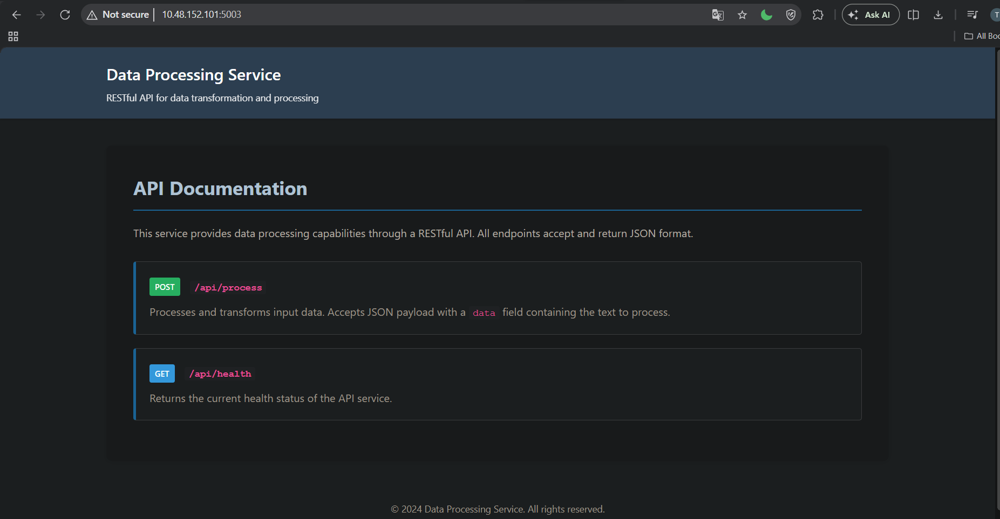
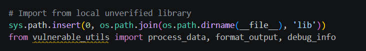
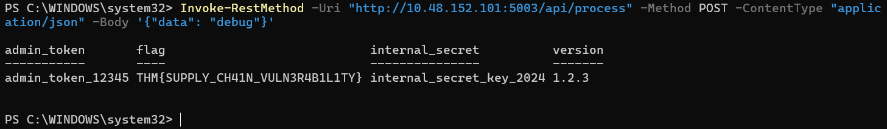

# AS03 — Software Supply Chain Failures

[← OWASP Top 10](./README.md)

**Thất bại trong chuỗi cung ứng phần mềm** xảy ra khi ứng dụng phụ thuộc vào các component, thư viện, dịch vụ hoặc model bị xâm phạm, lỗi thời, hoặc chưa được xác minh đúng cách. Điểm yếu không nằm trong code bạn viết — mà nằm trong phần mềm và công cụ bạn tin tưởng. Attacker khai thác những điểm đó để chèn code độc, bypass security, hoặc đánh cắp dữ liệu mà không cần động vào logic ứng dụng của bạn.

Trong phiên bản 2021, rủi ro này nằm chung dưới "Vulnerable and Outdated Components". Đến 2025, OWASP tách ra thành hạng mục riêng — phản ánh thực tế rằng supply chain attack đã trở thành một vector tấn công có chủ đích với quy mô và độ tinh vi ngày càng tăng.

---

## Tại sao quan trọng

Ứng dụng hiện đại được xây dựng từ hàng trăm package, API bên thứ ba, và ngày càng nhiều AI model. Một dependency bị xâm phạm có thể làm tổn hại toàn bộ hệ thống — cho phép attacker truy cập mà không cần chạm vào code của chính bạn. Các cuộc tấn công chuỗi cung ứng thường được tự động hóa và phân tán, khiến chúng đặc biệt khó phát hiện và thiệt hại rất lớn.

---

## Ví dụ thực tế

**SolarWinds Orion (2021):** Attacker chèn code độc vào một bản cập nhật đáng tin cậy của SolarWinds Orion, ảnh hưởng đến hàng nghìn tổ chức đã tự động cài bản cập nhật đó — bao gồm nhiều cơ quan chính phủ Mỹ. Đây không phải lỗi trong logic cốt lõi của SolarWinds. Đó là lỗ hổng trong quy trình build, verify và phân phối bản cập nhật. Phần mềm trông hoàn toàn hợp lệ vì nó được ký số bởi chính SolarWinds.

**event-stream (2018):** Package npm có 2 triệu download/tuần. Maintainer chuyển ownership cho người lạ, người đó thêm dependency `flatmap-stream` chứa code obfuscated đánh cắp Bitcoin wallet. Tồn tại 2 tháng trước khi bị phát hiện.

**XZ Utils (2024):** Attacker dành 2 năm build trust với project, trở thành maintainer, rồi inject backdoor vào quá trình build của version 5.6.0–5.6.1. Nhắm vào systemd để chiếm SSH trên Linux. Bị phát hiện tình cờ nhờ Andres Freund nhận thấy SSH login chậm bất thường.

**AI/ML model risk:** Dùng model bên thứ ba chưa được kiểm chứng hoặc fine-tune trên dataset có thể chứa hành vi ẩn, backdoor trigger, hoặc output thiên vị làm tổn hại hệ thống hoặc rò rỉ dữ liệu. Với AI pipeline, supply chain không chỉ là code — mà còn là data, weight, và inference infrastructure.

---

## Biểu hiện phổ biến

**Dùng thư viện và dependency chưa được kiểm chứng hoặc không còn được maintain.**

**Tự động cài bản cập nhật mà không verify:** Auto-update tiện lợi nhưng mỗi bản cập nhật là một điểm tin tưởng ngầm. Attacker biết điều này.

**Phụ thuộc quá mức vào AI model bên thứ ba mà không có audit hay giám sát.**

**Build pipeline và CI/CD không được bảo vệ:** Cho phép can thiệp vào quá trình build — attacker không cần modify source code, chỉ cần modify artifact trong pipeline.

**Theo dõi giấy phép và provenance của component kém:** Không biết component đến từ đâu → không biết khi nào nó bị xâm phạm.

**Thiếu monitoring vulnerability trong dependency sau khi đã deploy:** Lỗ hổng được phát hiện sau ngày deploy → không ai biết → hệ thống chạy với component có CVE đã public.

---

## Các kiểu tấn công

**Dependency confusion:** Attacker publish package lên public registry (npm, PyPI) trùng tên với package nội bộ của công ty nhưng version số cao hơn. Package manager ưu tiên public registry → kéo về package độc hại.

```
# Internal: @company/utils v1.0.0 (Artifactory nội bộ)
# Attacker publish: company-utils v9.9.9 (npmjs.com public)
# npm install → lấy public vì version cao hơn
```

**Typosquatting:** Tên gần giống package phổ biến, chờ developer gõ nhầm.

```
requests  →  request
lodash    →  loadash
express   →  expres
```

**Account takeover:** Chiếm tài khoản npm/PyPI của maintainer package phổ biến → publish version mới chứa malware → tất cả người dùng auto-update đều bị ảnh hưởng.

**Malicious container base image:** Base image trên Docker Hub chứa backdoor. Image trông hợp lệ, có nhiều pull, nhưng layer ẩn có code độc.

---

## Phát hiện

```bash
# Kiểm tra vulnerability trong npm dependency
npm audit

# Python
pip-audit

# Tìm dependency không trong lockfile
npm ls --depth=0
```

Theo dõi liên tục:
- CVE mới cho dependency đang dùng (Dependabot, Renovate, Snyk)
- Thay đổi maintainer của package quan trọng
- Spike bất thường trong build time hoặc artifact size

---

## Lab thực hành

Demo Flask server mô phỏng lỗ hổng AS03 — import từ thư viện nội bộ chưa được xác minh (`lib/vulnerable_utils.py`). Script: [`app-1763304148639.py`](./app-1763304148639.py)

**Mục tiêu:** Server chạy tại `http://10.48.152.101:5003/`, cung cấp API xử lý dữ liệu.



**Lỗ hổng trong code:** Server dùng `sys.path.insert` để load thư viện từ thư mục `lib/` cục bộ — không có signature check, không có integrity verification. Bất kỳ file nào trong `lib/` đều được tin tưởng hoàn toàn.



**Khai thác:** Gửi `{"data": "debug"}` tới `/api/process` kích hoạt hàm `debug_info()` từ `vulnerable_utils` — rò rỉ toàn bộ biến môi trường, bao gồm secrets và flag.

```powershell
Invoke-RestMethod -Uri "http://10.48.152.101:5003/api/process" -Method POST `
  -ContentType "application/json" -Body '{"data": "debug"}'
```



Flag: `THM{SUPPLY_CH41N_VULN3R4B1L1TY}` — cùng với `admin_token_12345` và `internal_secret_key_2024` bị rò rỉ.

Đây chính xác là kiểu tấn công XZ Utils: không cần can thiệp vào logic chính — chỉ cần kiểm soát một dependency được tin tưởng ngầm.

---

## Phòng chống

**Xác minh tất cả component trước khi dùng:** Thư viện, API bên thứ ba, và đặc biệt là AI model — kiểm tra nguồn gốc, maintainer, lịch sử commit trước khi đưa vào dependency.

**Theo dõi và vá dependency thường xuyên:** Đừng chỉ audit lúc onboard — CVE mới xuất hiện sau ngày bạn install.

**Ký tên, verify và audit bản cập nhật:** Không auto-update mù. Lockfile nghiêm ngặt (`package-lock.json`, `poetry.lock`, `Cargo.lock`) — chỉ update có chủ đích.

**Khóa CI/CD pipeline:** Build environment cô lập, không cho phép can thiệp từ ngoài vào artifact trong quá trình build. Verify integrity của output trước khi deploy.

**Theo dõi provenance và giấy phép:** Biết mỗi component đến từ đâu, ai maintain, giấy phép là gì. SLSA framework giúp verify provenance qua toàn bộ pipeline.

**Private registry với allowlist:** Dùng Artifactory hoặc Nexus, chỉ pull từ public registry qua proxy đã được scan. Giải quyết dependency confusion bằng cách scope internal package (`@company/name`) và cấu hình registry resolve scope đó chỉ từ internal.

**Runtime monitoring:** Phát hiện hành vi bất thường từ dependency hoặc AI component trong lúc chạy — network call lạ, file access bất thường, memory spike.

**Tích hợp supply chain risk vào SDLC:** Đánh giá rủi ro chuỗi cung ứng từ giai đoạn thiết kế, không chỉ là bước cuối trước deploy.

---

## Tham khảo

- OWASP: https://owasp.org/Top10/A06_2021-Vulnerable_and_Outdated_Components/
- SLSA: https://slsa.dev
- OpenSSF Scorecard: https://securityscorecards.dev
