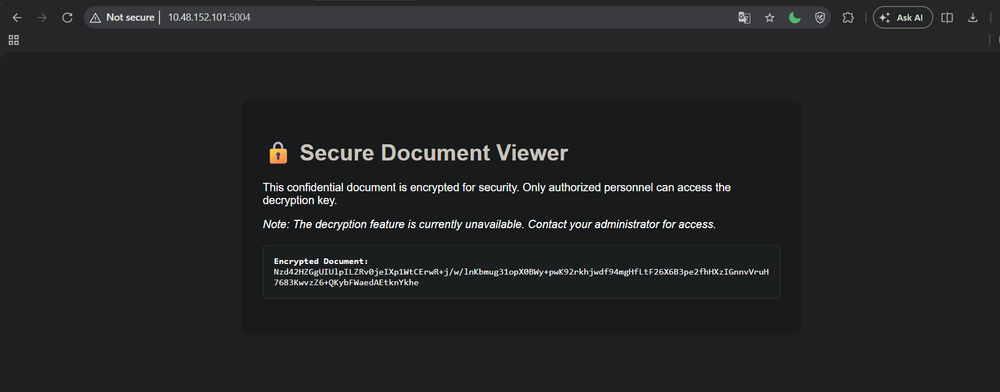
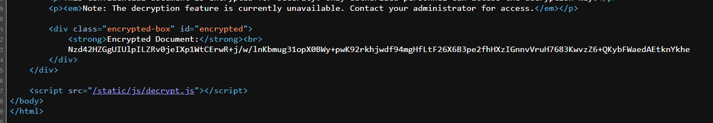
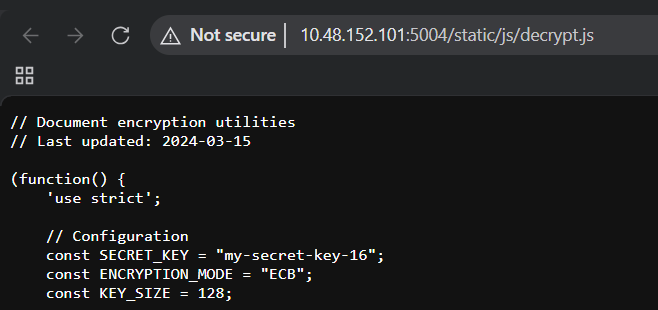

# AS04 — Cryptographic Failures

[OWASP Top 10](./README.md)

**Lỗi mã hóa** — hạng mục AS04 trong OWASP Top 10 2025. Tên cũ trong phiên bản 2021 là "Sensitive Data Exposure" nhưng cách đặt tên đó mô tả hậu quả chứ không phải nguyên nhân. Tên mới nhấn mạnh root cause: đây là lỗi ở tầng mật mã — dùng thuật toán sai, dùng đúng thuật toán nhưng sai cách, hoặc không dùng mã hóa khi cần.

---

## Root cause

Mật mã học khó. Không phải khó về mặt toán học — mà khó ở chỗ rất dễ làm sai theo cách trông có vẻ đúng. Dùng AES nhưng dùng ECB mode thay vì GCM. Hash mật khẩu bằng SHA-256 thay vì bcrypt. Generate random token bằng `Math.random()` thay vì CSPRNG. Tất cả đều "có mã hóa" nhưng đều sai.

Ngoài ra, nhiều lỗi đến từ việc kế thừa code cũ — thuật toán từng được coi là an toàn (MD5, SHA1, DES, RC4) vẫn tồn tại trong codebase vì không ai dám đụng vào.

---

## Các lỗi phổ biến

**Dùng thuật toán đã deprecated:**
- MD5, SHA1 cho hashing dữ liệu quan trọng — đã bị collision attack
- DES, 3DES, RC4 cho encryption
- RSA-1024 khi RSA-2048 là minimum hiện tại

**Hash mật khẩu sai cách:**

```python
# SAI: SHA-256 không phải password hash — nhanh quá, brute force dễ
import hashlib
hashed = hashlib.sha256(password.encode()).hexdigest()

# ĐÚNG: bcrypt, Argon2, hoặc scrypt — chậm có chủ đích
import bcrypt
hashed = bcrypt.hashpw(password.encode(), bcrypt.gensalt(rounds=12))
```

**Dùng ECB mode:**

ECB (Electronic Codebook) encrypt từng block độc lập — cùng plaintext cho ra cùng ciphertext. Pattern trong dữ liệu vẫn visible sau khi encrypt.

```
# AES-ECB encrypt ảnh bitmap: structure của ảnh vẫn nhìn thấy được
# AES-GCM: ciphertext trông như noise ngẫu nhiên hoàn toàn
```

**IV/nonce cố định hoặc tái sử dụng:**

Với stream cipher và GCM mode, tái sử dụng nonce với cùng key là thảm họa — attacker có thể recover plaintext bằng XOR.

**Weak random number generation:**

```javascript
// SAI: Math.random() không phải cryptographically secure
const token = Math.random().toString(36).slice(2)

// ĐÚNG: crypto.randomBytes()
const crypto = require('crypto')
const token = crypto.randomBytes(32).toString('hex')
```

**Thiếu TLS hoặc TLS misconfigured:**
- HTTP thay vì HTTPS cho dữ liệu nhạy cảm
- Chấp nhận TLS 1.0/1.1 (đã deprecated)
- Disable certificate verification trong code để "dễ test"

**Hardcoded key trong source code:**

```python
SECRET_KEY = "hardcoded-secret-1234"  # committed vào git → tồn tại mãi mãi trong history
```

**Lưu sensitive data không cần thiết:**

Data không được lưu không thể bị đánh cắp. Nhiều hệ thống lưu CVV, full card number, hay plaintext password vì "có thể cần sau này".

**AI/ML systems thiếu secret handling:**

Model parameter, API key của inference service, hay input nhạy cảm đưa vào AI pipeline thường không được bảo vệ đúng cách. Prompt log, embedding lưu vào vector DB, hoặc fine-tune data chứa PII đều là bề mặt tấn công mới mà nhiều team AI bỏ qua.

---

## Ví dụ tấn công

**Rainbow table attack:** Database bị dump, mật khẩu hash bằng MD5 không salt. Attacker tra cứu precomputed table → recover 80% mật khẩu trong vài phút.

**POODLE / BEAST:** Exploit TLS 1.0 CBC padding oracle để decrypt HTTPS traffic. Lý do TLS 1.0/1.1 bị disable trên mọi browser hiện đại.

**Nonce reuse (GCM):** Hai message encrypt bằng cùng key + nonce:
```
C1 = P1 XOR KeyStream
C2 = P2 XOR KeyStream
→ C1 XOR C2 = P1 XOR P2
```
Nếu attacker biết một plaintext, recover được plaintext kia.

---

## Phát hiện

```bash
# Tìm thuật toán deprecated trong codebase
grep -rn "MD5\|SHA1\|DES\|RC4\|ECB" --include="*.py" --include="*.js" --include="*.java" .

# Tìm hardcoded key
grep -rn "SECRET\|PASSWORD\|API_KEY\|private_key" --include="*.py" . | grep -v ".env"

# Kiểm tra TLS config
nmap --script ssl-enum-ciphers -p 443 target.com
testssl.sh https://target.com
```

---

## Phòng chống

**Thuật toán đúng cho đúng mục đích:**

| Mục đích | Nên dùng | Không dùng |
|---|---|---|
| Hash mật khẩu | Argon2id, bcrypt, scrypt | MD5, SHA-1/256 |
| Hash dữ liệu | SHA-256, SHA-3 | MD5, SHA-1 |
| Symmetric encryption | AES-256-GCM, ChaCha20-Poly1305 | DES, 3DES, AES-ECB |
| Asymmetric | RSA-2048+, ECDSA P-256 | RSA-1024 |
| Random token | CSPRNG (crypto.randomBytes) | Math.random() |

**Key management:**
- Dùng dedicated secret manager thay vì env file: Azure Key Vault, AWS KMS, HashiCorp Vault
- Maintain inventory đầy đủ các certificate, key, và owner của chúng — không thể rotate thứ bạn không biết tồn tại
- Rotate key định kỳ theo chu kỳ đã định, và ngay lập tức khi có nghi ngờ bị lộ
- Xây dựng SOP cho key lifecycle: generation → distribution → rotation → revocation

**Nguyên tắc:**
- Không tự implement crypto — dùng thư viện đã được audit
- Key và secret không bao giờ trong code hay config file commit vào git
- Encrypt data in transit (TLS 1.3, hoặc tối thiểu TLS 1.2) và at rest
- Không lưu data nhạy cảm nếu không có lý do rõ ràng
- AI model và automation agent không bao giờ expose unencrypted secret hoặc sensitive data — log, embedding, và inference input đều phải trong scope của data protection policy

---

## Lab thực hành

"Secure Document Viewer" tại `http://10.48.152.101:5004/` — ứng dụng hiển thị tài liệu mã hóa, tuyên bố chỉ authorized personnel mới giải mã được.



**Lỗ hổng 1 — Key hardcoded trong client-side JS:** Trang load `decrypt.js` qua `<script src="/static/js/decrypt.js">`. Mở file đó trong browser là thấy toàn bộ secret.



**Lỗ hổng 2 — ECB mode:** `decrypt.js` lộ hai vấn đề cùng lúc — key hardcoded và chế độ mã hóa yếu.



```
SECRET_KEY       = "my-secret-key-16"   ← hardcoded, visible với mọi người dùng
ENCRYPTION_MODE  = "ECB"                ← mode yếu, không che pattern
KEY_SIZE         = 128
```

**Khai thác:** Dùng key và mode lấy từ source → decrypt ciphertext:

```powershell
$key = [System.Text.Encoding]::UTF8.GetBytes("my-secret-key-16")
$ct  = [System.Convert]::FromBase64String("<ciphertext từ trang>")
$aes = [System.Security.Cryptography.Aes]::Create()
$aes.Key = $key; $aes.Mode = "ECB"; $aes.Padding = "PKCS7"
[System.Text.Encoding]::UTF8.GetString($aes.CreateDecryptor().TransformFinalBlock($ct, 0, $ct.Length))
```

Kết quả: `CONFIDENTIAL: The admin password is 'admin123'. Flag: THM{CRYPTO_FAILURE_H4RDCOD3D_K3Y}`

Đây là minh họa hoàn hảo cho hai lỗi AS04 cùng lúc: key hardcoded trong code (ai cũng đọc được) + ECB mode (plaintext pattern không bị che). Mã hóa có tồn tại nhưng hoàn toàn vô nghĩa.

---

## Tham khảo

- OWASP: https://owasp.org/Top10/A02_2021-Cryptographic_Failures/
- OWASP Cryptographic Storage Cheat Sheet: https://cheatsheetseries.owasp.org/cheatsheets/Cryptographic_Storage_Cheat_Sheet.html
- NIST Guidelines: https://csrc.nist.gov/publications/detail/sp/800-57-part-1/rev-5/final
