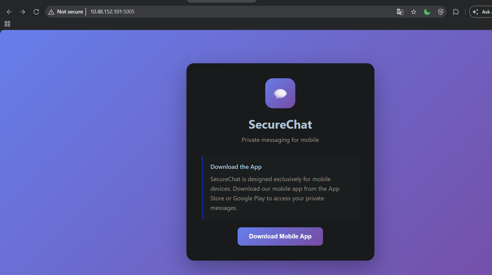
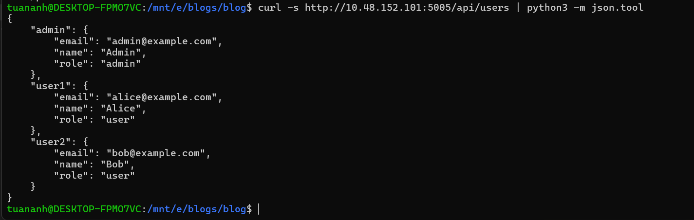
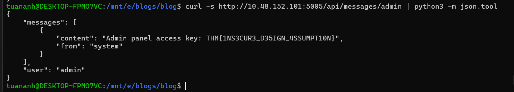

# AS06 — Insecure Design

[← OWASP Top 10](./README.md)

**Thiết kế không an toàn** — hạng mục AS06 trong OWASP Top 10 2025. Đây là mục đáng chú ý nhất trong danh sách 2021/2025 vì nó khác về bản chất so với các mục còn lại: không phải lỗi implementation, không phải misconfiguration, không phải component lỗi thời. Đây là lỗi xuất phát từ giai đoạn thiết kế — khi cả team không ai nghĩ đến security khi đưa ra quyết định kiến trúc.

Lỗi implementation có thể patch. Lỗi thiết kế thường đòi hỏi viết lại.

---

## Root cause

Security thường được nhét vào cuối chu kỳ phát triển như một bước QA, không phải là một yêu cầu thiết kế ngay từ đầu. Kết quả là feature được build ra với những assumption ngầm định không bao giờ được kiểm tra từ góc độ tấn công.

Không có threat modeling → không ai hỏi "nếu user làm X thì sao?". Không có security requirement → developer build cái gì hoạt động chứ không phải cái gì an toàn. Không có design review → lỗi ở tầng kiến trúc đến tận production mới lộ.

---

## Biểu hiện phổ biến

**Business logic không có kiểm soát:**

Luồng nghiệp vụ có assumption rằng user sẽ làm theo đúng thứ tự. Attacker bỏ qua step, replay request, hoặc manipulate state.

Ví dụ: Luồng đặt hàng → thanh toán → xác nhận. Nếu ứng dụng không verify rằng đơn hàng đã được thanh toán trước khi tạo shipping order, attacker có thể skip bước thanh toán.

**Thiếu rate limit ở cấp thiết kế:**

```
# Tính năng "gửi OTP qua SMS"
POST /auth/send-otp { phone: "0901234567" }

# Không có rate limit → attacker spam → 
# 1. DoS victim bằng SMS flood
# 2. Chi phí SMS tăng vọt cho công ty
# 3. Enumerate số điện thoại tồn tại trong hệ thống
```

Rate limit không phải thêm middleware là xong — cần quyết định từ design: rate limit theo IP? Account? Device fingerprint? Kết hợp?

**Tin tưởng ngầm vào internal service:**

Microservice A gọi microservice B không xác thực, vì "chúng cùng một mạng nội bộ". Nếu A bị compromise hoặc có SSRF, B hoàn toàn mở.

Design đúng: zero-trust, mỗi service call đều có authentication và authorization dù là internal.

**Không tách biệt concern:**

Admin function và user function chạy chung code path. Chỉ kiểm tra role ở UI nhưng không ở backend. Attacker gọi thẳng API endpoint của admin.

**Lộ thông tin qua error message theo thiết kế:**

```json
// Thiết kế "helpful" trả về error chi tiết
{
  "error": "User with email john@example.com not found"
}
// → Attacker enumerate email tồn tại trong hệ thống
```

So sánh với thiết kế đúng:
```json
{ "error": "Invalid credentials" }  // cùng message cho cả hai trường hợp
```

**Workflow không có bước verify:**

"Đặt lại mật khẩu" chỉ hỏi ngày sinh và tên thú cưng → thông tin này có thể tìm trên mạng xã hội. Không có verification channel độc lập (email/SMS).

---

## Ví dụ tấn công

**Clubhouse (2021):** Thiết kế ban đầu giả định người dùng chỉ tương tác qua mobile app. Nhưng backend API không có cơ chế xác thực đúng cách — bất kỳ ai cũng có thể query trực tiếp: dữ liệu user, thông tin phòng họp, kể cả các cuộc trò chuyện được gọi là "riêng tư". Khi researcher thử nghiệm, "toàn bộ tiền đề về 'private conversation' đã sụp đổ." Lỗi không nằm ở code — nằm ở assumption thiết kế rằng API chỉ được gọi từ app.

**Airline seat selection — logic flaw kinh điển:**

Hệ thống cho phép chọn ghế sau khi mua vé, không verify rằng ghế đang được yêu cầu thuộc về chuyến bay của user. Attacker chọn ghế của user khác trên chuyến bay khác bằng cách manipulate flight ID trong request.

**Coupon stacking không giới hạn:**

```
POST /apply-coupon { code: "SAVE10" }
# Không có giới hạn số lần apply cùng coupon
# Không check coupon đã được dùng cho order này chưa
# → Apply nhiều lần → giá về 0
```

**Insecure Direct Object Reference theo design:**

```
GET /invoice/1234   # invoice của user hiện tại
GET /invoice/1235   # invoice của user khác — không có authorization check
```

Đây không chỉ là thiếu check — là thiết kế API expose internal ID ra ngoài mà không nghĩ đến authorization model.

---

## Thiết kế không an toàn trong kỷ nguyên AI

AI đưa vào một lớp lỗi thiết kế mới mà các checklist truyền thống không bắt được.

**Các assumption sai phổ biến:**
- "Model sẽ hành xử đúng theo ý định" — không có gì đảm bảo điều này mà không có validation
- "Mã do AI generate là không có lỗi" — AI-assisted code cần review như mọi code khác
- "Internal AI service không cần authorization boundary"

**Kiểu lỗi thiết kế AI-specific:**

| Lỗi | Hậu quả |
|-----|---------|
| AI component có quyền hạn không bị giới hạn | Attacker abuse agent để thực hiện hành động ngoài scope |
| Thiếu guardrail cho LLM và automation agent | Agent bị hijack, thực thi lệnh ngoài ý muốn |
| Prompt injection — system prompt lẫn với user input | Attacker override context, exfiltrate hidden data |
| Blind trust vào model output — không có validation | Hệ thống hành động dựa trên output sai hoặc bị manipulate |
| Model lấy từ nguồn chưa kiểm chứng hoặc fine-tune trên data độc | Hidden behavior, backdoor trigger nhúng sẵn trong weight |
| Debug/testing feature còn sót lại trong production | Attacker exploit diagnostic endpoint |

**Prompt injection là ví dụ điển hình:** Khi user input được nối thẳng vào system prompt mà không có tách biệt rõ ràng, attacker có thể craft input để override instruction, thay đổi behavior, hoặc rò rỉ nội dung system prompt. Đây không phải lỗi code — là lỗi thiết kế về trust boundary giữa system context và user data.

---

## Phát hiện

Insecure design khó phát hiện bằng automated tool vì không phải code bug — là logic flaw. Cần:

- **Threat modeling:** Vẽ data flow diagram, liệt kê trust boundary, hỏi "attacker có thể làm gì ở mỗi điểm?"
- **Business logic testing:** Test các luồng theo thứ tự bất thường, bỏ qua step, replay request cũ
- **Pentest tập trung vào flow:** Không chỉ test từng endpoint riêng lẻ mà test cả workflow
- **Code review tập trung vào assumption:** Tìm chỗ code assume user đã làm gì đó mà không verify

---

## Phòng chống

**Threat modeling từ sớm:** Trước khi viết code, hỏi: ai là actor? họ có thể làm gì? điều gì tệ nhất có thể xảy ra? STRIDE là framework phổ biến.

**Security requirement rõ ràng:** Mỗi user story cần có acceptance criteria về security, không chỉ về functional behavior.

**Defense in depth theo thiết kế:** Không rely vào một lớp bảo vệ duy nhất. Rate limit + captcha + monitoring, không chỉ rate limit.

**Principle of least privilege từ đầu:** Mỗi component chỉ có đúng quyền nó cần. Design authorization model trước khi build feature.

**Fail secure:** Khi có lỗi hoặc edge case, hành vi mặc định phải là từ chối, không phải cho phép.

**Không tin ngầm:** Mọi boundary đều cần authentication và authorization — internal hay external.

**Với AI component:**
- Coi mọi model là untrusted cho đến khi có bằng chứng ngược lại — validate và filter cả input lẫn output
- Tách biệt system message khỏi user content, không cho phép user input ảnh hưởng trực tiếp đến system prompt
- Không đưa sensitive data vào prompt trừ khi thực sự cần, và bảo vệ bằng kiểm soát nghiêm ngặt
- Yêu cầu human review cho high-risk AI action
- Log model provenance, monitor hành vi runtime, áp dụng differential security cho data nhạy cảm
- Đưa AI-specific threat modeling vào thiết kế từ đầu: prompt injection, inference risk, agent abuse, supply chain compromise

---

## Lab thực hành

"SecureChat" tại `http://10.48.152.101:5005/` — ứng dụng nhắn tin được thiết kế "exclusively for mobile devices". Frontend chỉ là landing page, không có gì để tương tác.



**Lỗ hổng:** Backend API không có cơ chế xác thực — assumption rằng chỉ có mobile app mới gọi API. Gọi thẳng từ terminal là đủ để dump toàn bộ user list:

```bash
curl -s http://10.48.152.101:5005/api/users | python3 -m json.tool
```



Biết được username `admin`, gọi thẳng vào private messages của họ:

```bash
curl -s http://10.48.152.101:5005/api/messages/admin | python3 -m json.tool
```



Flag: `THM{1NS3CUR3_D35IGN_4SSUMPT10N}` — lộ từ private message của admin mà không cần đăng nhập hay token gì cả.

Đây là Clubhouse trong thực tế: thiết kế giả định chỉ có mobile app mới gọi API → không đặt auth ở backend → toàn bộ "private conversation" thành public với bất kỳ ai biết endpoint.

---

## Tham khảo

- OWASP: https://owasp.org/Top10/A04_2021-Insecure_Design/
- OWASP Threat Modeling: https://owasp.org/www-community/Threat_Modeling
- STRIDE framework: https://learn.microsoft.com/en-us/azure/security/develop/threat-modeling-tool-threats
