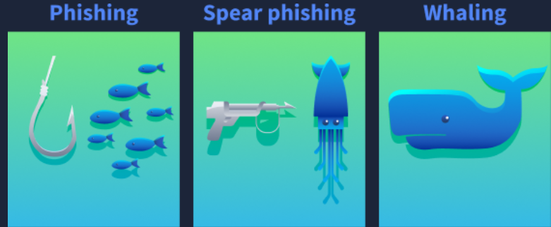

# Phishing

[Web Attacks](../README.md)

**Phishing** là tấn công social engineering — khai thác tâm lý con người thay vì lỗ hổng kỹ thuật. Attacker giả mạo danh tính đáng tin cậy (ngân hàng, IT support, đồng nghiệp cấp cao) để lừa nạn nhân cung cấp credential, cài malware, hoặc thực hiện hành động ngoài ý muốn.

Kênh tấn công: email, SMS (smishing), cuộc gọi thoại (vishing), và trang web giả mạo trông giống hệt trang gốc.

---

## Phân loại

### Phishing (đại trà)

Gửi cùng một tin nhắn đến hàng nghìn nạn nhân cùng lúc. Nội dung chung chung — cảnh báo tài khoản, hóa đơn, thông báo giao hàng. Mục tiêu là volume: đánh cắp mật khẩu, thông tin thẻ tín dụng, hoặc chiếm quyền kiểm soát thiết bị ở quy mô lớn.

Dấu hiệu nhận biết: sender domain hơi sai (`paypa1.com` thay vì `paypal.com`), nội dung tạo áp lực khẩn cấp, link dẫn đến domain lạ.

### Spear Phishing (có chủ đích)

Tấn công cá nhân hóa cho một mục tiêu cụ thể. Attacker OSINT trước — tên, chức vụ, dự án đang làm, người quản lý — rồi craft email/tin nhắn trông hợp lý đến mức nạn nhân không nghi ngờ.

Mục tiêu thường là: nhân viên IT (có quyền truy cập hệ thống), tài chính (có thể chuyển tiền), hoặc bất kỳ ai có quyền tạo foothold vào mạng nội bộ.

### Whaling (nhắm C-level)

Spear phishing nhắm vào CEO, CFO, CISO — người có quyền ra quyết định chiến lược. Giá trị mục tiêu cao hơn → attacker đầu tư nhiều hơn vào research và kịch bản.

Đòn bẩy điển hình: Business Email Compromise (BEC) — "CEO" yêu cầu CFO chuyển tiền khẩn cấp cho deal M&A bí mật.

---

## Vai trò trong Pentest

Phishing là thành phần cốt lõi của social engineering assessment — đánh giá mức độ dễ bị tổn thương của con người trong tổ chức, song song với đánh giá kỹ thuật.

**Mục tiêu của phishing simulation:**
- Phát hiện điểm yếu nhận thức bảo mật trong nhân viên
- Đánh giá rủi ro thực tế khi tấn công thành công (rò rỉ dữ liệu, malware execution)
- Cung cấp dữ liệu để cải thiện chương trình đào tạo

**Quy trình cơ bản:**
1. Reconnaissance — thu thập thông tin mục tiêu (LinkedIn, website công ty, email format)
2. Craft email giả mạo gần với mối đe dọa thực tế
3. Gửi đến nhóm mục tiêu (toàn công ty hoặc phòng ban cụ thể)
4. Track metrics: tỷ lệ mở, tỷ lệ click, tỷ lệ submit credential
5. Report — chỉ ra điểm yếu, không gây thiệt hại thực sự

**Lưu ý:** Phishing simulation bắt buộc phải có ủy quyền bằng văn bản từ tổ chức mục tiêu trước khi thực hiện.

---

## Tham khảo

- MITRE ATT&CK T1566: https://attack.mitre.org/techniques/T1566/
- MITRE ATT&CK T1566.001 (Spear Phishing Attachment): https://attack.mitre.org/techniques/T1566/001/
- MITRE ATT&CK T1566.002 (Spear Phishing Link): https://attack.mitre.org/techniques/T1566/002/
